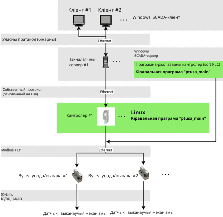
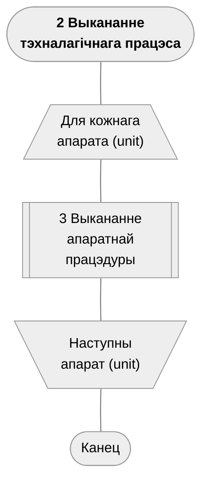
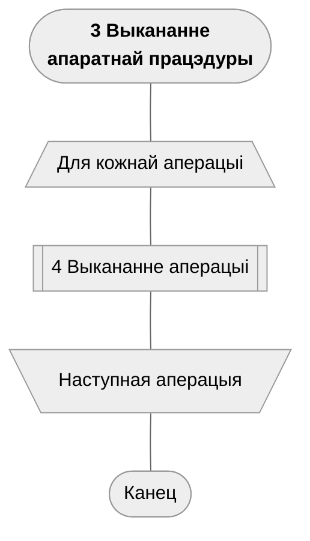
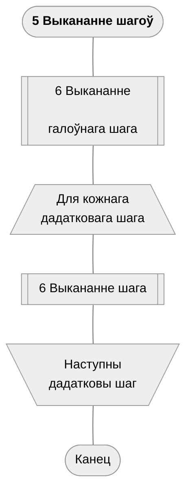
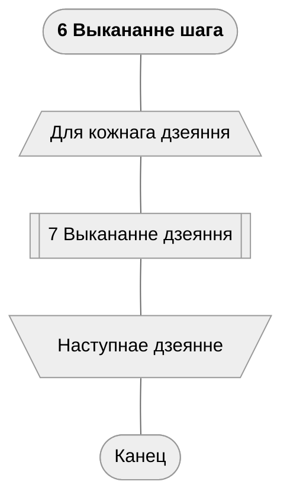
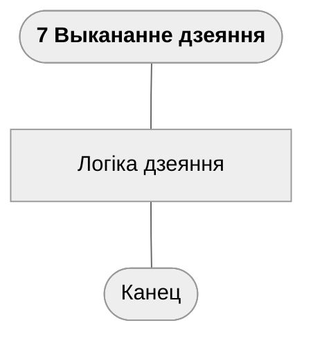
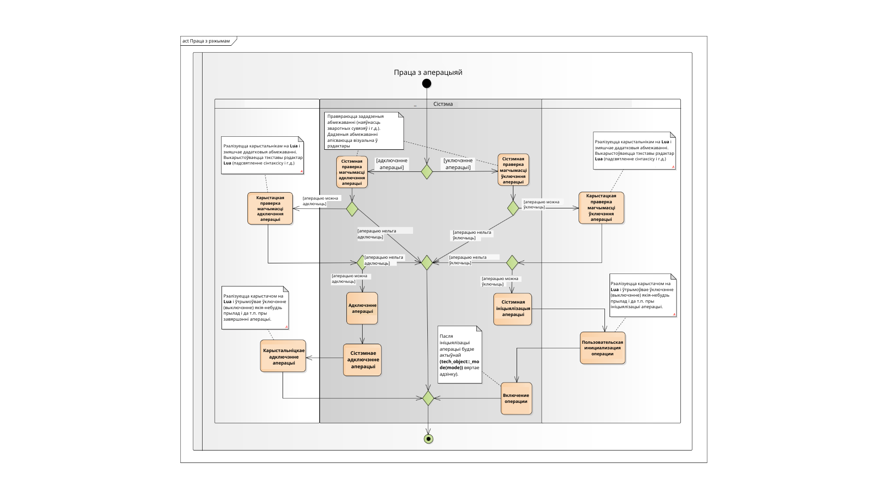
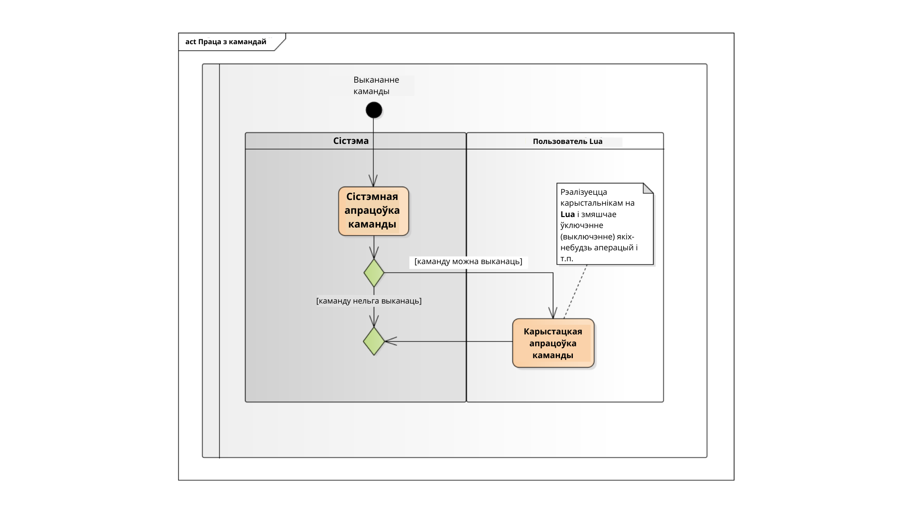

# ptusa_main #
> [!TIP]
> English version is [here](../../readme.md).\
> Русский вариант находится [здесь](../russian_readme/readme.md).

Праграма **``ptusa_main``** непасрэдна кіруе тэхналагічным
працэсам.

## Змест ##

1. [Агульная архітэктура сістэмы](#агульная-архітэктура-сістэмы)
2. [Агульнае апісанне](#агульнае-апісанне)
3. [Как собрать проект](#як-сабраць-праект)
4. [Выкарыстанне набора інструментаў PLCnext Technology C++ для АС
   Windows](#выкарыстанне-набора-інструментаў-plcnext-technology-c-для-ас-windows)
5. [Як запусціць праект](#як-запусціць-праект)
6. [Дакументацыя](#дакументацыя)

## Агульная архітэктура сістэмы ##

Агульная архітэктура аўтаматызаванай сістэмы кіравання
тэхналагічным працэсам (**АСКТП**) прыведзена на рысунку ніжэй:



## Агульнае апісанне ##

Кіруючая логіка рэалізуецца ў выглядзе скрыпта Lua. 
Падчас выканання праграмы кіраванне перадаецца ў асобныя спецыяльныя 
функцыі Lua, каторыя адказваюць за асобныя этапы.

+ Агульная схема працы праграмы кантролера (у [Drakon](https://drakonhub.com)
  diagram language)


+ Выкананне тэхналагічнага працэса:












+ Пры ўключэнні/выключэнні аперацыі адбываецца наступнае:



+ Пры выкананні каманды адбываецца наступнае:



## Як сабраць праект ##

Вы можаце кланіраваць рэпазіторый з дапамогай наступнай каманды:
`git clone --recurse-submodules https://github.com/savushkin-r-d/ptusa_main.git`

Або, калі вы кланіравалі праект без ініцыялізаваных і абнаўлённых
падмодулей, паспрабуйце наступную каманду:

`git submodule update --init --recursive`

### win ###

Патрабаванні:

+ Qt Creator

У Qt вы можаце адкрыць файл CMakeList.txt кланіраванага рэпазіторыя.

Або кланіраваць рэпазіторый з выкарыстаннем Qt:
```Добавить -> Импортировать проект -> Клонирование Git``` 
[дабавіць спасылку на рэпазіторый],
Паставіць галачку для рэкурсіўнага кланіравання.

+ Microsoft Visual Studio Community 2022

Перад запускам праекта неабходна пераканацца ў тым, што ў вас 
усталяваны C++ CMake tools for Windows.
Сродкі C++ CMake для Windows усталёўваюцца пры дапамозе:

`Visual Studio Installer -> Разработка классических приложений на C++ ->
Средства CMake C++ для Windows`
Падрабязную інфармацыю па ўсталяванню можна атрымаць
[тут](https://docs.microsoft.com/ru-ru/cpp/build/cmake-projects-in-visual-studio?view=msvc-160).
Версія CMake, неабходная для зборкі: 3.13 і вышэй.

Пасля гэтага вам трэба адкрыць (у Visual Studio) карнявы каталог.
Такім чынам, вы атрымаеце праект на аснове CMake.
Калі пасля запуска ўзнікла памылка, то неабходна
ачысціць кэш CMake: 
`Проект -> Удалить кэш` і выканаць перанастройку.

### Linux ###

Eclipse IDE з праектам на базе CMake у Linux.

## Выкарыстанне набора інструментаў PLCnext Technology C++ для АС Windows ##

Спампуйце апошнія версіі з веб-сайта Phoenix Contact
<https://www.phoenixcontact.com/products> (напрыклад, для **AXC F 2152**)
`PLCnext Technology C++ Toolchain для Windows` (актуальная версія 2023.0 LTS) і `sdk для
Windows 64 bit` (актуальная версія 2022.0.4 LTS), у разделе 
`Загрузки->Программное обеспечение` $-$ <http://www.phoenixcontact.com/qr/2404267/softw>.

Перайдзіце ў каталог, дзе знаходзяцца загрузкі (тыповы шлях
`%userprofile%/Downloads`), распакуйце архіў
(`SDK_2021.9_Windows_AXC_F_2152.tar.xz.zip`).

### Усталяванне (абнаўленне) SDK ###

Перайдзіце ў каталог, у якім раней быў распакаваны архіў,
выканайце выклік CLI у кансолі наступнай камандай:

```ps
plcncli.exe install sdk –d [путь установки] –p [путь к архивному файлу]
```

>Калі вы усталёўваеце некалькі SDK, Phoenix Contact 
> рекамендуецца выыкарыстоўваць структуру каталогаў
> рекомендует использовать "імя кантролера/версія ПЗ"
структуру папок "целевое имя/версия встроенного ПО".

Таксама ваш шлях усталявання павінен супадаць са шляхам у CMake.

Напрыклад:

```ps
plcncli.exe install sdk -d C:\CLI\sdks\AXCF2152\2022_0 \ -p pxc-glibc-x86_64-mingw32-axcf2152-image-mingw-cortexa9t2hf-neon-axcf2152-toolchain-2022.0.tar.xz
```

>SDK указаны для кантролера. Поўны спісак кантролераў можна знайсці
> на сайте
PHOENIX CONTACT [Home > Products > PLCs and
I/O systems > PLCnext Control > Product list PLCnext Technology
components](https://www.phoenixcontact.com/online/portal/pi?1dmy&urile=wcm%3apath%3a/pien/web/main/products/list_pages/PLCnext_technology_components_P-21-14-01/f77f0eb0-2a70-40c3-8679-7df2450e26db)).

## Як запусціць праект ##

Для запуска дэма-праекта трэба выкарыстоўваць гэту каманду:

### windows ###

+ Пасля зборкі і разгортвання *`windows-default`* cmake канфігурацыі:

```cmd
    bin\install\windows-default\Release\ptusa_main.exe ^
    --path demo_projects/T1-PLCnext-Demo/ ^
    --sys_path demo_projects/T1-PLCnext-Demo/sys/ ^
    --debug ^
    demo_projects/T1-PLCnext-Demo/main.plua
```

+ Запуск праекта ў Microsoft Visual Studio Community 2022: `Выбрать элемент
запуска -> ptusa_main.exe`.

## Дакументацыя ##

### Дакументацыя прылад ###

Дакументацыя па падтрымліваемым прыладам знаходзіцца ў каталозе:
[docs/devices](../devices/).

Дакументаваныя прылады:

+ [TM311](../devices/TM311.md) - Датчык тэмпературы Endress+Hauser TM311
  IO-Link (тэхнічная дакументацыя)
+ [TM311 Кіраўніцтва карыстальніка](../devices/TM311_user_guide.md) -
  Кіраўніцтва для інжынераў АСКТП

### Іншая дакументацыя ###

+ [Стратэгія тэсціравання](../test/readmeBY.md) - Інфармацыя аб падходзе да тэсціравання.
+ [Кіраўніцтва па стылю кода](../style.md) - Стандарты і пагадненні па коду.
+ [Кіраўніцтва аб удзеле](../CONTRIBUTING.md) - Як унесці свой уклад у праект.
