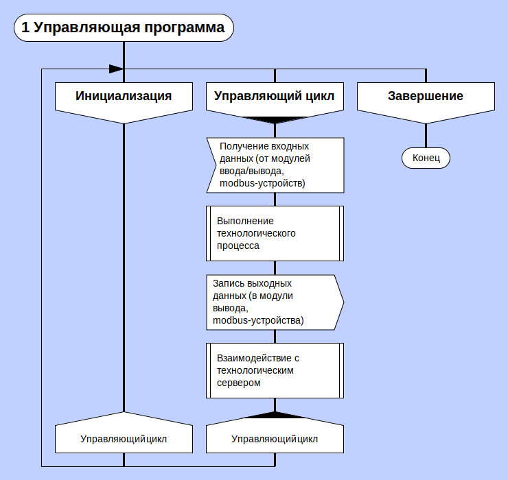
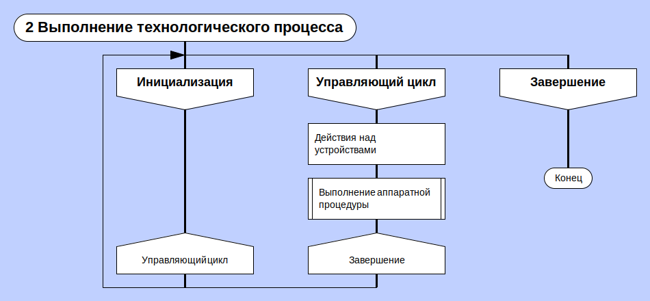
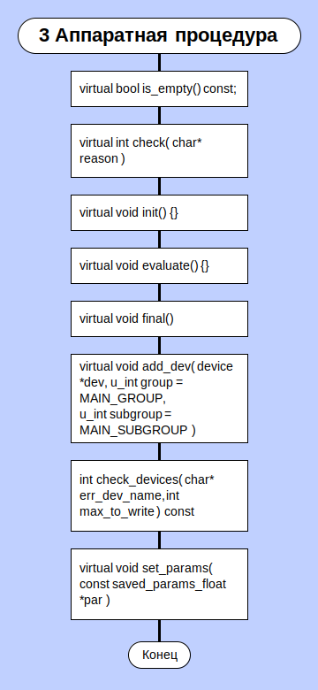
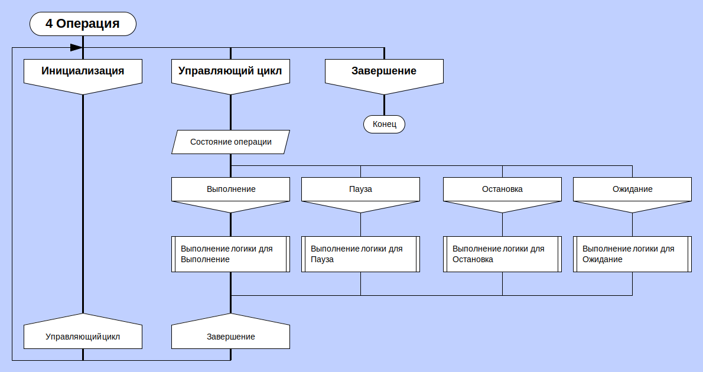
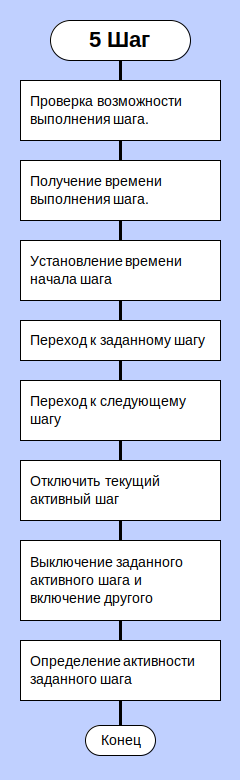
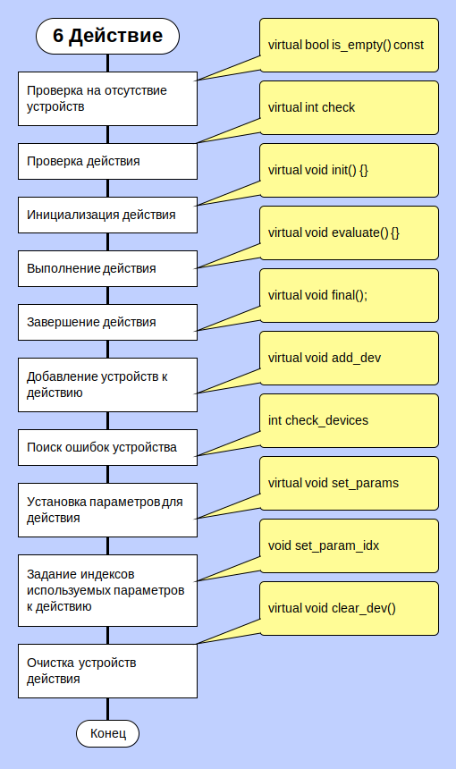

# Технологическая схема

Документ отображает последовательность этапов технологического процесса. Содержит описания классов, которые используются для организации шагов при выполнении операций танка, гребенки. 

## 1. Архитектура программы
  
**1.1 Управляющая программа**

Управляющая программа - системная программа, реализующая набор функций управления:
 - управление ресурсами системы обработки информации; 
 - взаимодействие с внешней средой системы обработки информации; 
 - восстановление работы системы после проявления неисправностей в технических средствах.

Рисунок 1 - Управляющая программа

**1.2 Выполнение технологического процесса**

Технологический процесс — это совокупность выстроенных в определенном порядке операций.

Рисунок 2 - Выполнение технологического процесса

**1.3 Аппаратная процедура**

На данном этапе предполагается выполнение аппаратной частью полученных команд, а также возвращение результатов выполнения.

Рисунок 3 - Аппаратная процедура

**1.4 Операция**

Операция — конструкция, аналогичная по записи математическим операциям, то есть специальный способ записи некоторых действий. Операции выполняются в строгой последовательности. 

Рисунок 4 - Операция

**1.5 Шаг**

Выполнение по шагам - это простейший способ выполнения программы по элементарным фрагментам.

Рисунок 5 - Шаг

**1.6 Действие**

Данная диаграмма содержит информацию о классах, описывающих действия, которые выполняются над устройствами.

Рисунок 6 - Действие
