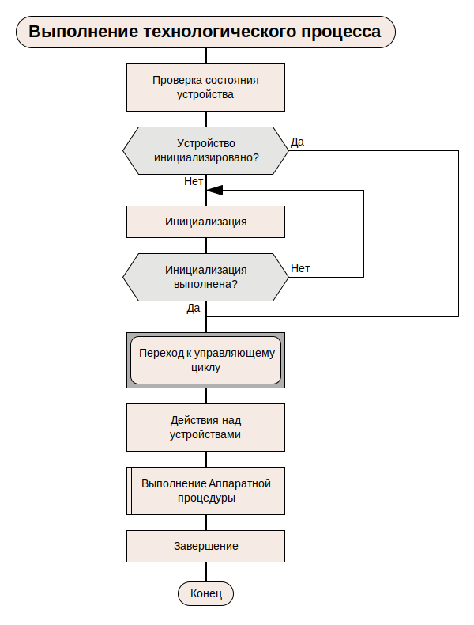
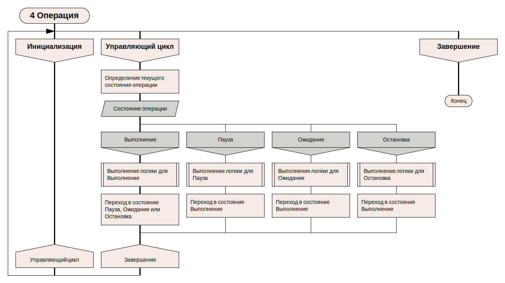
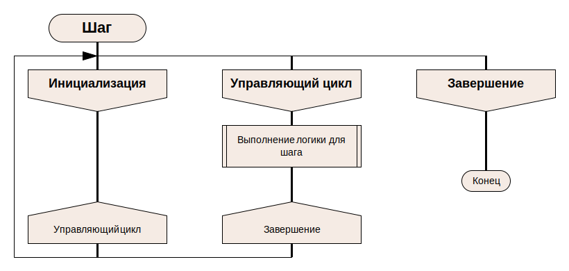

# Алгоритм выполнения технологического процесса

Документ отображает последовательность этапов технологического процесса.  

## 1. Архитектура программы
  
**1.1 Управляющая программа**

Рисунок 1 - Управляющая программа

**1.2 Выполнение технологического процесса**

Рисунок 2 - Выполнение технологического процесса

**1.3 Аппаратная процедура**

Рисунок 3 - Аппаратная процедура

**1.4 Операция**

Рисунок 4 - Операция

**1.5 Шаг**

Рисунок 5 - Шаг

**1.6 Действие**

Рисунок 6 - Действие
