# General class scheme #

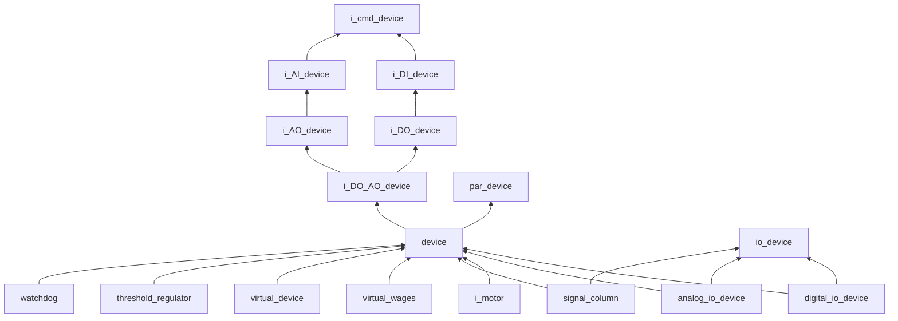

## Class DO1 scheme ##

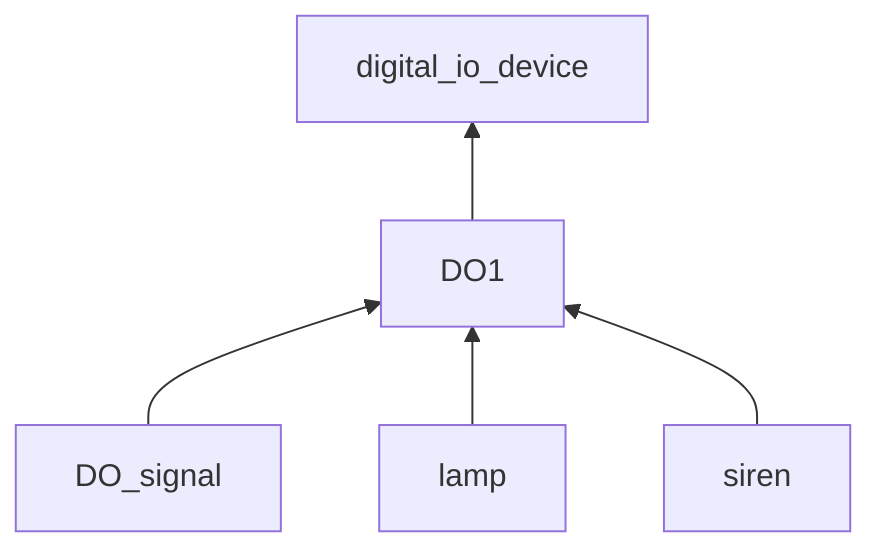

## Class DI1 scheme ##

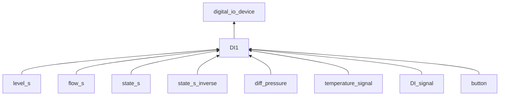

## Class i_wages scheme ##

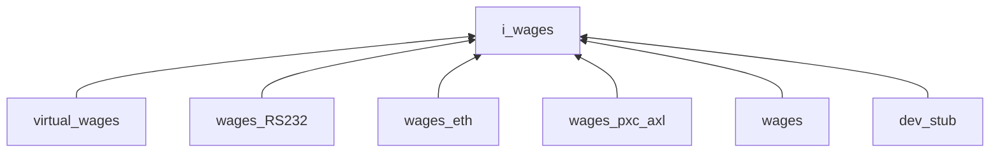

## Class analog_io_device scheme ##

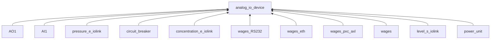

## Class valve scheme ##

```mermaid
flowchart BT
    valve_DO2_DI2_bistable[valve_DO2_DI2_bistable] --> valve[valve]
    virtual_valve[virtual_valve] --> valve
    valve_DO1[valve_DO1] --> valve
    valve_DO2[valve_DO2] --> valve
    valve_DO1_DI1_off[valve_DO1_DI1_off] --> valve
    valve_DO1_DI1_on[valve_DO1_DI1_on] --> valve
    valve_DO1_DI2[valve_DO1_DI2] --> valve
    valve_DO2_DI2[valve_DO2_DI2] --> valve
    valve_mix_proof[valve_mix_proof] --> valve
    valve_AS[valve_AS] --> valve
    valve_AS_mix_proof[valve_AS_mix_proof] --> valve_AS
    valve_AS_DO1_DI2[valve_AS_DO1_DI2] --> valve_AS
    valve_bottom_mix_proof[valve_bottom_mix_proof] --> valve
    valve_mini_flushing[valve_mini_flushing] --> valve
    valve_iolink_mix_proof[valve_iolink_mix_proof] --> valve
    valve_iolink_shut_off_thinktop[valve_iolink_shut_off_thinktop] --> valve
    valve_iolink_shut_off_sorio[valve_iolink_shut_off_sorio] --> valve
    valve_iolink_gea_tvis_a15[valve_iolink_gea_tvis_a15] --> valve
    valve_iolink_gea_tvis_a15_ss[valve_iolink_gea_tvis_a15_ss] --> valve_iolink_gea_tvis_a15
    valve_iolink_gea_tvis_a15_ds[valve_iolink_gea_tvis_a15_ds] --> valve_iolink_gea_tvis_a15
    valve_iol_terminal[valve_iol_terminal] --> valve
    valve_iol_terminal_mixproof_DO3[valve_iol_terminal_mixproof_DO3] --> valve
    valve_iol_terminal_mixproof_DO3_DI2[valve_iol_terminal_mixproof_DO3_DI2] --> valve
    dev_stub[dev_stub] --> valve
```

## Class i_mix_proof scheme ##

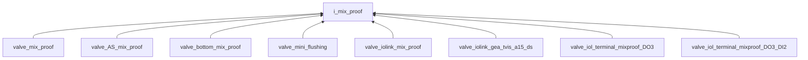

## Class AI1 scheme ##

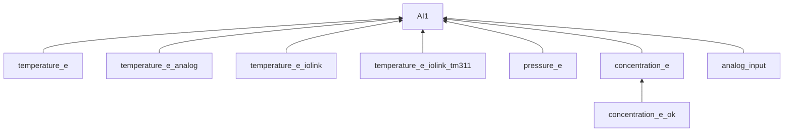

## Class i_motor scheme ##

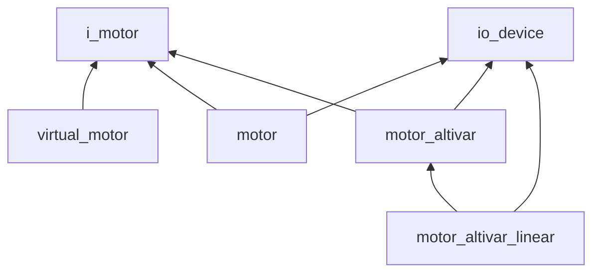

## Class level scheme ##

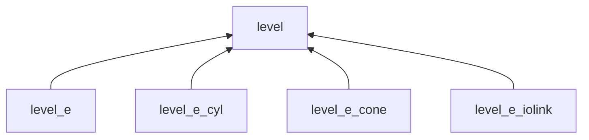

## Class action scheme ##

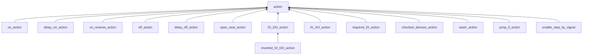
