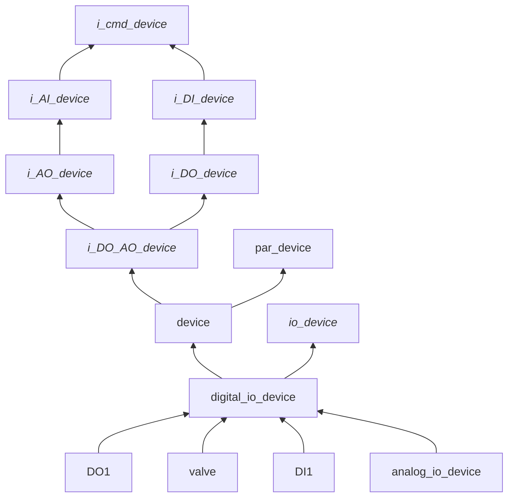
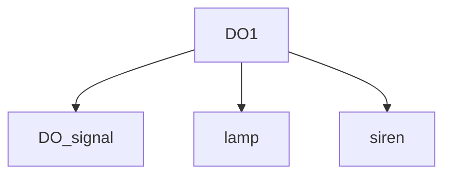
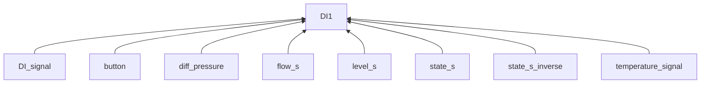
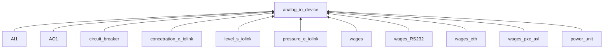
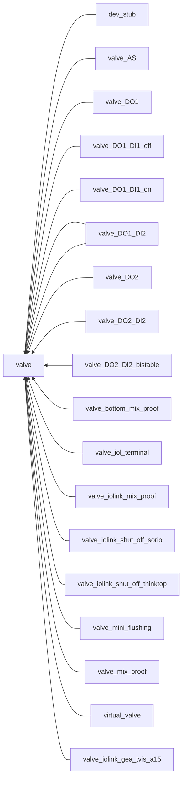

# General class scheme #

```mermaid
flowchart BT
digital_io_device[digital_io_device]
digital_io_device-->device[device]
digital_io_device-->io_device[<i>io_device</i>]
device-->i_DO_AO_device[<i>i_DO_AO_device</i>]
device-->par_device[par_device]
i_DO_AO_device-->i_AO_device[<i>i_AO_device</i>]
i_DO_AO_device-->i_DO_device[<i>i_DO_device</i>]
i_AO_device-->i_AI_device[<i>i_AI_device</i>]
i_DO_device-->i_DI_device[<i>i_DI_device</i>]
i_AI_device-->i_cmd_device[<i>i_cmd_device</i>]
i_DI_device[<i>i_DI_device</i>]-->i_cmd_device[<i>i_cmd_device</i>]
DO1[DO1]-->digital_io_device
valve[valve]-->digital_io_device
DI1[DI1]-->digital_io_device
analog_io_device[analog_io_device]-->digital_io_device
```

## Class DO1 scheme ##

```mermaid
flowchart TB
    DO1-->DO_signal
    DO1-->lamp
    DO1-->siren
```

## Class DI1 scheme ##

```mermaid
flowchart BT
    DI_signal-->DI1
    button-->DI1
    diff_pressure-->DI1
    flow_s-->DI1
    level_s-->DI1
    state_s-->DI1
    state_s_inverse-->DI1
    temperature_signal-->DI1
```

## Class analog_io_device scheme ##

```mermaid
flowchart BT
 analog_io_device[analog_io_device]
    AI1[AI1]-->analog_io_device
    AO1[AO1]-->analog_io_device
    circuit_breaker[circuit_breaker]-->analog_io_device
    concetration_e_iolink[concetration_e_iolink]-->analog_io_device
    level_s_iolink[level_s_iolink]-->analog_io_device
    pressure_e_iolink[pressure_e_iolink]-->analog_io_device
    wages[wages]-->analog_io_device
    wages_RS232[wages_RS232]-->analog_io_device
    wages_eth[wages_eth]-->analog_io_device
    wages_pxc_axl[wages_pxc_axl]-->analog_io_device
    power_unit[power_unit]-->analog_io_device
```

## Class valve scheme ##

```mermaid
flowchart RL
    dev_stub[dev_stub]-->valve
    valve_AS[valve_AS]-->valve
    valve_DO1[valve_DO1]-->valve
    valve_DO1_DI1_off[valve_DO1_DI1_off]-->valve
    valve_DO1_DI1_on[valve_DO1_DI1_on]-->valve
    valve_DO1_DI2[valve_DO1_DI2]-->valve
    valve_DO1_DI2[valve_DO1_DI2]-->valve
    valve_DO2[valve_DO2]-->valve
    valve_DO2_DI2[valve_DO2_DI2]-->valve
    valve_DO2_DI2_bistable[valve_DO2_DI2_bistable]-->valve
    valve_bottom_mix_proof[valve_bottom_mix_proof]-->valve
    valve_iol_terminal[valve_iol_terminal]-->valve
    valve_iolink_mix_proof[valve_iolink_mix_proof]-->valve
    valve_iolink_shut_off_sorio[valve_iolink_shut_off_sorio]-->valve
    valve_iolink_shut_off_thinktop[valve_iolink_shut_off_thinktop]-->valve
    valve_mini_flushing[valve_mini_flushing]-->valve
    valve_mix_proof[valve_mix_proof]-->valve
    virtual_valve[virtual_valve]-->valve
    valve_iolink_gea_tvis_a15[valve_iolink_gea_tvis_a15]-->valve
```
