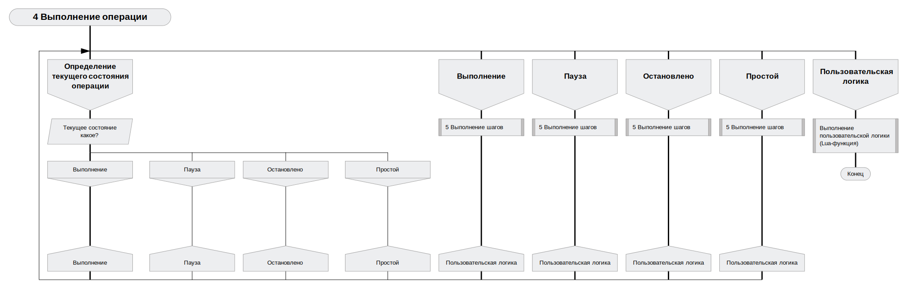

# ptusa_main #

Программа **``ptusa_main``** непосредственно управляет технологическим процессом.

## Содержание ##

1. [Общая архитектура системы](#общая-архитектура-системы)
2. [Общее описание](#общее-описание)
3. [Как собрать проект](#как-собрать-проект)
4. [Использование набора инструментов PLCnext Technology C++ для ОС Windows](#использование-набора-инструментов-plcnext-technology-c-для-ос-windows)
5. [Как запустить проект](#как-запустить-проект)
6. [Документация](#документация)

## Общая архитектура системы ##

Общая архитектура автоматизированной системы управления технологическим процессом (**АСУТП**) изображена на рисунке ниже:


## Общее описание ##

Управляющая логика реализуется в виде скрипта Lua. В ходе выполнения программы управление передается в отдельные специальные функции Lua, которые отвечают за отдельные этапы.

+ Общая схема работы программы контроллера (в [Drakon](https://drakonhub.com) diagram language)

<p align="center"></p>

+ Выполнение технологического процесса:


<p align="center"></p>


+ При включении/выключении операции происходит следующее:


+ При выполнении команды происходит следующее:


## Как собрать проект ##

Вы можете клонировать репозиторий при помощи следующей команды:
`git clone --recurse-submodules https://github.com/savushkin-r-d/ptusa_main.git`

Или, если вы клонировали проект без инициализированных и обновленных подмодулей, попробуйте следующее:
`git submodule update --init --recursive`

### win ###

Требования:

+ Qt Creator

В Qt вы можете открыть файл CMakeList.txt клонированного репозитория.

Или клонировать репозиторий используя Qt:
    Добавить -> Импортировать проект -> Клонирование Git
    указать ссылку на репозиторий и поставить галочку для рекурсивного клонирования.

+ Microsoft Visual Studio Community 2022

Перед запуском проекта необходимо убедиться в том, что у вас установлен C++ CMake tools for Windows.
Средства C++ CMake для Windows устанавливаются с помощью:

`Visual Studio Installer -> Разработка классических приложений на C++ -> Средства CMake C++ для Windows `

Подробную информацию по установке можно получить [здесь](https://docs.microsoft.com/ru-ru/cpp/build/cmake-projects-in-visual-studio?view=msvc-160). Версия CMake, необходимая для сборки: 3.13 и выше.

После этого вы должны открыть (в Visual Studio) корневой каталог. Таким образом, вы получаете проект на основе CMake. Если после запуска возникла ошибка, то следует очистить кэш CMake: `Проект -> Удалить кэш и выполнить перенастройку`.

### linux ###

Eclipse IDE с проектом на базе CMake в Linux.

## Использование набора инструментов PLCnext Technology C++ для ОС Windows ##

Загрузите последние версии с веб-сайта Phoenix Contact https://www.phoenixcontact.com/products (например, из области **AXC F 2152**) `PLCnext Technology C++ Toolchain для Windows` (текущая 2023.0 LTS) и `sdk для Windows 64 bit` (текущая 2022.0.4 LTS) , в разделе Загрузки->Программное обеспечение $-$ http://www.phoenixcontact.com/qr/2404267/softw.

Перейдите в папку, где находятся загрузки (типичный путь `%userprofile%/Downloads`), распакуйте архив (`SDK_2021.9_Windows_AXC_F_2152.tar.xz.zip`).

### Установка (обновление) SDK ###

Перейдите в папку, в которую ранее был распакован архив, вызовите CLI в консоли, используя следующую команду:

```ps
plcncli.exe install sdk –d [путь установки] –p [путь к архивному файлу]
```

>Если вы устанавливаете несколько SDK, Phoenix Contact рекомендует использовать структуру папок "целевое имя/версия встроенного ПО".

Также ваш путь установки должен совпадать с путем в CMake.

Например:

```ps
plcncli.exe install sdk -d C:\CLI\sdks\AXCF2152\2022_0 \ -p pxc-glibc-x86_64-mingw32-axcf2152-image-mingw-cortexa9t2hf-neon-axcf2152-toolchain-2022.0.tar.xz
```

>SDK указан для контроллера. Полный список контроллеров можно найти на сайте PHOENIX CONTACT ([Главная страница > Продукция > ПЛК и системы ввода-вывода > Управление PLCnext > Список продуктов Технология PLCnext components](https://www.phoenixcontact.com/online/portal/pi?1dmy&urile=wcm%3apath%3a/pien/web/main/products/list_pages/PLCnext_technology_components_P-21-14-01/f77f0eb0-2a70-40c3-8679-7df2450e26db))

## Как запустить проект ##

Для запуска демо проекта вы должны использовать эту команду:

### windows ###

+ После сборки и развертывания *`windows-default`* конфигурации cmake:

```cmd
    bin\install\windows-default\Release\ptusa_main.exe ^
    --path demo_projects/T1-PLCnext-Demo/ ^
    --sys_path demo_projects/T1-PLCnext-Demo/sys/ ^
    --debug ^
    demo_projects/T1-PLCnext-Demo/main.plua
```

+ Запуск проекта в Microsoft Visual Studio Community 2022: `Выбрать элемент запуска -> ptusa_main.exe`.

## Документация ##

### Документация устройств ###

Документация по поддерживаемым устройствам находится в каталоге [docs/devices](../devices/).

Документированные устройства:
- [TM311](../devices/TM311.md) - Датчик температуры Endress+Hauser TM311 IO-Link (техническая документация)
- [TM311 - Руководство пользователя](../devices/TM311_user_guide.md) - Руководство для инженеров АСУТП

### Другая документация ###

- [Стратегия тестирования](../test/readme.md) - Информация о подходе к тестированию
- [Руководство по стилю кода](../style.md) - Стандарты и соглашения по коду
- [Руководство по участию](../CONTRIBUTING.md) - Как внести вклад в проект
