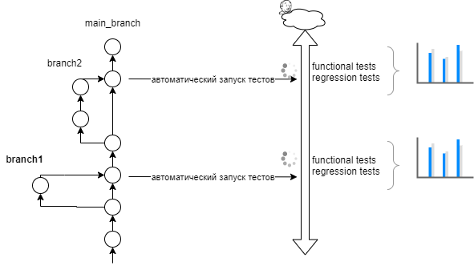
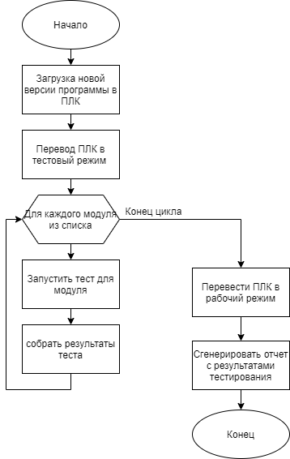

# СТРАТЕГИЯ АВТОМАТИЗАЦИИ ТЕСТИРОВАНИЯ ПРОЕКТА #
> [!TIP]
> Беларускі варыянт знаходзіцца [тут](./readmeBY.md).

Документ содержит описание стратегии автоматизации тестирования проекта.

## Архитектура проекта ##

Проект состоит из следующих составляющих:
1.	IOT – модуль для работы с дополнительными устройствами.
2.	OPCUAServer – модуль для связи с сервером используя спецификацию OPC Unified Architecture.
3.	G_LUA_MANAGER – модуль для работы c системными и пользовательскими скриптами написанными в Lua.
4.	G_PROFIBUS_SLAVE – модуль для работы с промышленной сетью PROFIBUS.
5.	G_PROJECT_MANAGER – модуль, отвечающий за конфигурацию проекта, а именно, обработку входных параметров, загрузку конфигурации для G_LUA_MANAGER, установку путей к системным и пользовательским файлам Lua.
6.	G_IO_MANAGER – чтение и запись состояний модулей ввода/вывода
7.	G_DEVICE_MANAGER – модуль содержит информацию обо всех устройствах проекта (клапанов, двигателей, счетчиков и т.д.)
8.	G_TECH_OBJECT_MANAGER – модуль для управления технологическими объектами (танк, гребенка и т.д.)
9.	G_CMMCTR – tcp коммуникатор
10.	G_ERRORS_MANAGER – модуль обработки ошибок системы
11.	G_SIREN_LIGTHS_MANAGER – модуль для работы со световой звуковой сиреной (зеленой, желтой и красной лампочкой, а также со звуковой сиреной).
12.	G_LOG – модуль отвечающий за логирование

## Виды тестирования ##
Предлагается 3 этапа тестирования ПО:
- unit тесты
- тестирование производительности
- тестирование на этапе непрерывной интеграции
- тестирование ПО внутри системы (переводя ПЛК в тестовый режим на короткое время).

### Unit тесты ###
Покрытие классов проекта unit тестами позволяет уменьшить количество ошибок,
обнаруживаемых в работающей системе, уменьшит время на интеграцию новых
обновлений, увеличит производительность системы. Тестирование проекта активно,
обязательно для новых изменений.

### Тестирование производительности ###

Результаты тестов находятся здесь - <https://savushkin-r-d.github.io/benchmark-ptusa-main/docs/dev/bench/>.

## Непрерывная интеграция ##
В процесс разработки ведётся полноценный автоматизированный процесс непрерывной
интеграции (CI) нового кода (рис. 1). После каждого слияния небольшой
законченной функциональности с ветки разработчика в основную ветку запускаются
автоматические тесты:
-	Regression tests – регрессионные тесты
-	Functional tests – тесты новой функциональности
После чего генерируется рапорт в удобном для конечного пользователя виде (pdf, html, визуальные графики), который должен содержать как общую информацию тестирования, так и конкретную информацию об ошибках (логи).

Используется система **Github Actions**.

Рисунок 1: Схема автоматизации непрерывной интеграции нового кода

## Тестирование компонентов ПО внутри системы ##
Тестирование ПО внутри системы обеспечит быстрое нахождение потенциальных и существующих проблем не прибегая к ручному тестированию с использованием тестового стола. Автоматическое тестирование внутри системы можно интегрировать в процесс обновления программного обеспечения.
Автоматизация тестирования внутри системы не подразумевает использования
дополнительного оборудования (рис. 2)

Рисунок 2: Схема минимального оборудования, необходимого для тестирования
ПО внутри системы

Алгоритм тестирования ПО внутри системы представлен на рис. 4
Данный алгоритм реализуется на сервере в виде управляющей программы или исполняющего скрипта на любом ЯП, либо с использованием любого инструмента, обеспечивающего процесс непрерывной интеграции программного обеспечения, например Jenkins.
При необходимости загрузки нового ПО, сразу после апгрейда, ПЛК переводится в тестовый режим специальной командой. Перевод ПЛК в тестовый режим означает – реконфигурацию таким способом, чтоб модули ПО ПЛК оставались в работоспособном состоянии, но не оказывали никакого воздействия на систему и устройства которыми данный ПЛК управляет, либо к которым ПЛК подключен. Такой режим может быть реализован посредством ввода новых специальных MOCK-объектов (объектов заглушек). Пример MOCK-объекта – необходимо будет подготовить набор специальных «пустых», т.е. ничего не делающих, системных и пользовательских Lua скриптов.

Рисунок 3: Алгоритм тестирования ПО внутри системы

Далее сервер в цикле высылает команды для тестирования необходимых модулей ПО, собирает результаты тестов и генерирует отчет в удобной форме (pdf, html).
Автоматическое тестирование может выполняться, как и при обновлении ПО, так и в любой другой момент времени (в данном случае алгоритм изображенный рис. 3 не будет включать в себя шага загрузки новой версии программы в ПЛК).

## Компоненты и классы для тестирования ##
### Unit тесты ###
Unit тесты должны покрывать все классы ПО и обязательно запускаться перед сборкой новой версии программы.

### Модули ПО для тестирования внутри системы ###
Для тестирования внутри системы предлагается минимальный набор из следующих модулей:
1.	IOT модуль.
2.	OPCUAServer модуль.
3.	G_LUA_MANAGER модуль.
4.	G_PROFIBUS_SLAVE модуль.
5.	G_PROJECT_MANAGER модуль.
6.	G_TECH_OBJECT_MANAGER модуль.
7.	tcp коммуникатор
Также при необходимости можно расширить данный список другими модулями.

### Тест для одного модуля внутри системы ###
Тест модуля внутри системы представляет собой специальный класс самодиагностики. Во время самодиагностики должно проверяться:
-	функционирование модуля;
-	внутреннее состояние модуля;
-	статус подключения к другим модулям и/или устройствам;
-	сетевой статус, если модуль обеспечивает доступ к какой-либо сети.
Собранная информация в конце самодиагностики должна отправляться на сервер.

### Интерфейс для автоматического тестирования ###
Интерфейс подключения ПЛК к серверу должен быть дополнен следующими командами:
-	перевод ПЛК в тестовый режим;
-	перевод ПЛК в рабочий режим;
-	команда выполнения самодиагностики модуля (одна команда на модуль).
