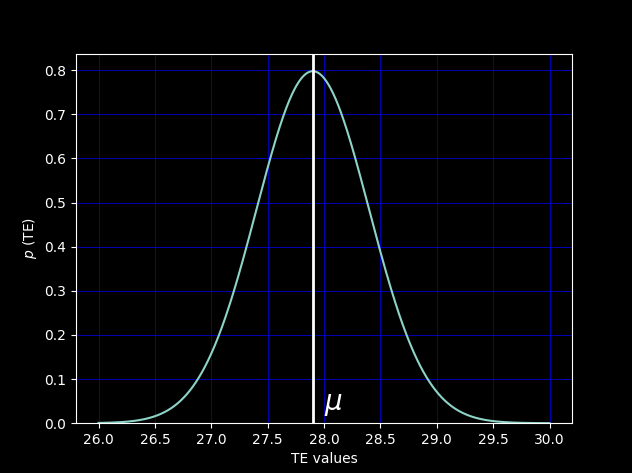
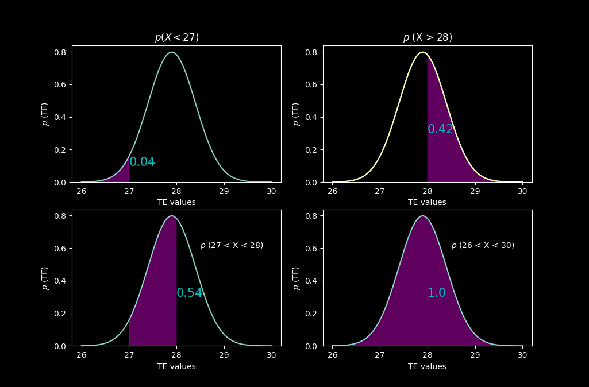
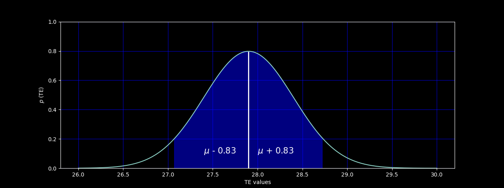

# Имитация аналогового устройства #
В качестве аналогового устройства выступает датчик температуры. Значения температуры в данной программе соответствуют функции нормального распределения.

## Нормальное распределение ##
Нормальное распределение - непрерывное распределение вероятностей с пиком в центре и симметричными боковыми сторонами, которое в одномерном случае задаётся функцией плотности вероятности, совпадающей с функцией Гаусса:

$$ f(x)= {1 \over (σ√2π)} e^{-{1\over 2}{\left(x-μ\over σ \right)}^2}$$

где ${μ}$ - математическое ожидание, $σ$ - среднеквадратичное отклонение, $σ^2$ - дисперсия распределения.

Математическое ожидание ${μ}$ - среднее значение случайной величины в результате многократного повторения:

$$ μ ={\sum x \over n}$$

Например, значения комнатной температуры могут находится примерно в интервале от 26 °C до 30°C. Если в течение всего дня фиксировать все изменения температуры в кабинете, то скорее всего мы увидим что-то на подобии [27.4, 26.9, 28.2, 29.1]. Математическим ожиданием или средним значением для такого интервала значений будет 27.9 °C.

Математическое ожидание ${μ}$ находится на пике графика. На оси $x$ находятся все значения температуры, ось $y$ показывает вероятность того, что наша случайная величина будет иметь заданную температуру.

<p align="center">
 </p>
<p align="center"> Математическое ожидание </p>

Вероятность $p$ можно вычислить, посчитав площадь графика в конкретном интервале, площадь всего графика равна 1.

<p align="center">
 </p>

Дисперсия - разброс значений случайной величины относительно математического ожидания. Дисперсию можно вычислить по формуле ниже:

$$ D={\sum (x-\mu)^2 \over n}$$

Квадрат в формуле нужен на случай отрицательных значений. Возвращаюсь к нашему примеру, дисперсия будет равна 0.695. Сама по себе дисперсия не очень информативна, более четкое понимание насколько рассеяны значения дает стандартное отклонение:

$$ \sigma ={\sqrt D} $$

При $D$ = 0.695 получим $ \sigma ={\sqrt {0.695} \approx 0.833667} $ °C


<p align="center">
 </p>
<p align="center"> Стандартное отклонение </p>

Т. е. чем больше $\sigma$, тем «шире» график.

## Реализация ##
Файлы с реализацией ```analog_emulator.h```  и ```analog_emulator.cpp``` находятся в папке ```ptusa_main/Pac/common```. В классе ```analog_emulator``` определены функции расчета стандартного отклонения ```get_st_deviation()```, вероятности ```is_p()```.

Переменные, используемые классом для расчета:
```с++
float dispersion;   ///< Дисперсия.
float m_expec;      ///< Математическое ожидание.
float st_deviation; ///< Стандартное отклонение.
float x;            ///< Случайная величина.
float p;            ///< Плотность вероятности.
```
Дисперсия и математическое ожидание, плотность вероятности, задаются в параметрах конструктора, также в конструктор можно передать первоначальное значения $x$ и минимальную с максимальной температуры.

Главная функция ```get_value()```, которая и возвращает некую температуру, присваивает $x$ случайное значение из заданного диапазона температур, а затем считает чему равна функция, т. е плотность вероятности в данной точке и больше ли она уже какого-то заданного ненулевого значения. Если условие истинно, то ```get_value()``` возвращает $x$ и записывает его в переменную ```prev_x```, которая хранит предыдущие значения температуры, на случай если у следующего $x$ будет слишком маленькая вероятность, тогда просто вернет старое значение температуры. ```prev_x``` инициализируется начальным значением функцией ```get_random()``` в теле конструктора, чтобы не вернуть ноль первым же значением $x$.

Функция ```is_p()``` считает значение функции плотности вероятности по [формуле](#markdown-header-нормальное-распределение) и возвращает ```true``` если результат больше заданного значения плотности вероятности ( переменной ```p``` ).

### Значения температуры ###
Диапазон температуры задается переменными ```min``` и ```max```. Класс ```analog_emulator``` содержит 2 вектора, они заполняются функцией ```init_vector```, которая вызывается в конструкторе, когда уже известны ```min``` и ```max```.
