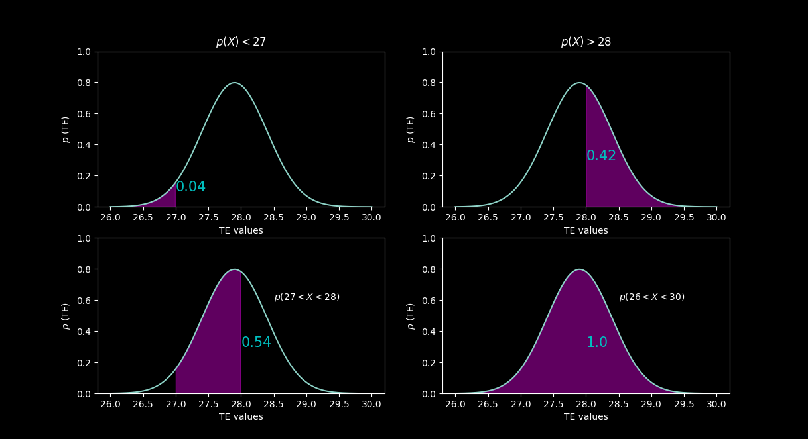

# Имитация аналогового устройства #
> [!TIP]
> Беларускі варыянт знаходзіцца [тут](./ReadMeBY.md).
>
В качестве аналогового устройства выступает датчик температуры. Значения температуры в данной программе соответствуют функции нормального распределения.

## Нормальное распределение ##

Нормальное распределение - непрерывное распределение вероятностей с пиком в центре и симметричными боковыми сторонами, которое в одномерном случае задаётся функцией плотности вероятности, совпадающей с функцией Гаусса:

$$ f(x)= {1 \over (σ√2π)} e^{-{1\over 2}{\left(x-μ\over σ \right)}^2}$$

где ${μ}$ - математическое ожидание, $σ$ - среднеквадратичное отклонение, $σ^2$ - дисперсия распределения.

Математическое ожидание ${μ}$ - среднее значение случайной величины в результате многократного повторения:

$$ μ ={\sum x \over n}$$

Например, значения комнатной температуры могут находиться, примерно, в интервале от 26 °C до 30°C. Если в течение всего дня фиксировать все изменения температуры в кабинете, то, скорее всего, мы увидим что-то на подобии [27.4, 26.9, 28.2, 29.1]. Математическим ожиданием или средним значением для такого интервала значений будет 27.9 °C.

Математическое ожидание ${μ}$ находится на пике графика. На оси $x$ находятся все значения температуры, ось $y$ показывает вероятность того, что наша случайная величина будет иметь заданную температуру.

<p align="center">
 </p>
<p align="center"> Математическое ожидание </p>

Вероятность $p$ можно вычислить, посчитав площадь графика в конкретном интервале. Площадь всего графика равна 1.

<p align="center">
 </p>

Дисперсия - разброс значений случайной величины относительно математического ожидания. Дисперсию можно вычислить по формуле ниже:

$$ D={\sum (x-\mu)^2 \over n}$$

Квадрат в формуле нужен на случай отрицательных значений. Возвращаясь к нашему примеру, дисперсия будет равна 0.695. Сама по себе дисперсия не очень информативна, более четкое понимание насколько рассеяны значения дает стандартное отклонение:

$$ \sigma ={\sqrt D} $$

При $D = 0.695$ получим

$$ \sigma ={\sqrt {0.695} \approx 0.833667} °C$$

<p align="center">
 </p>
<p align="center"> Стандартное отклонение </p>

Т.е. чем больше $\sigma$, тем «шире» график.

## Реализация ##

Файлы с реализацией ```analog_emulator.h``` и ```analog_emulator.cpp``` находятся в папке ```ptusa_main/Pac/common```. В классе ```analog_emulator``` определены методы ```get_st_deviation()```, ```get_m_expec()``` возвращают значения стандартного отклонения и математического ожидания. Математическое ожидание и стандартное отклонение задаются в параметрах конструктора.

Метод  ```get_value()``` c помощью объектов класса ```std::random_device``` (генерирует равномерно распределенные целые случайные числа) и ```std::normal_distribution``` (генерирует случайные числа согласно нормальному распределению) возвращает значения температуры. Математическое ожидание и стандартное отклонение $-$ параметры конструктора ```std::normal_distribution```. Чтобы в дальнейшем иметь возможность изменить параметры в ```analog_emulator``` определен метод ```param```, который принимает в качестве аргументов новые значения математического ожидания и стандартного отклонения.
