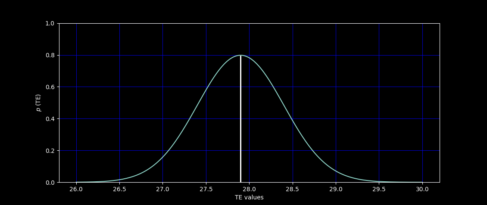
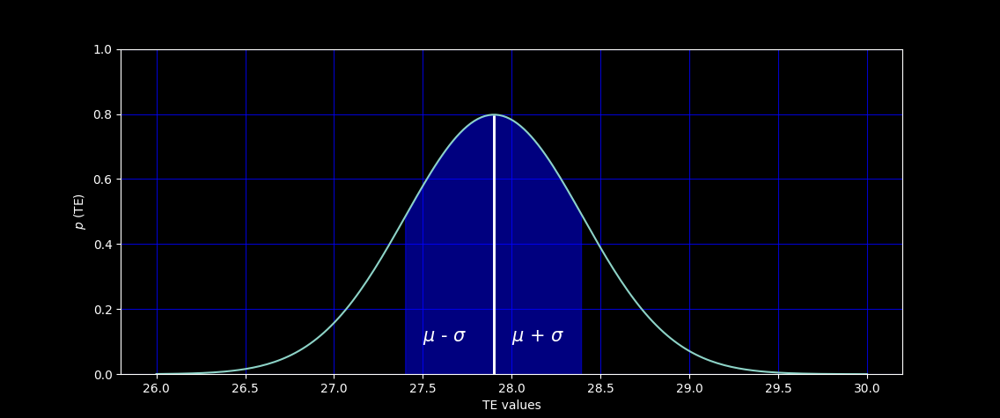

# Имитация датчика температуры #
Значения температуры в данной программе берутся из функции нормального распределения.

## Нормальное распределение ##
Нормальное распределение $-$ непрерывное распределение вероятностей с пиком в центре и симметричными боковыми сторонами, которое в одномерном случае задаётся функцией плотности вероятности, совпадающей с функцией Гаусса:

$$ f(x)= {1 \over (σ√2π)} e^{-{1\over 2}{\left(x-μ\over σ \right)}^2}$$

где ${μ}$ $-$ математическое ожидание, $σ$ $-$ cреднеквадратичное отклонение, $σ^2$ $-$ дисперсия распределения.

Математическое ожидание $-$ среднее значение случайной величины, в результате многократного повторения.
$$ μ ={\sum x \over n}$$

Например значения комнатной температуры могут находится примерно в интервале от 26 °C до 30°C. Если в течение всего дня фиксировать все изменения температуры в кабинете, то скорее всего мы увидим что-то на подобии [27.4, 26.9, 28.2, 29.1]. Математическим ожиданием или средним значением для такого интервала значений будет 27.9 °C.

 ${μ}$ находится на вершине или по середине графика. На оси $x$ находятся все значения температуры, ось $y$ показывает вероятность того, что наша случайная величина будет иметь заданную температуру.

 

 Математическое ожидание 

 Вероятность $p$ можно вычислить, посчитав площадь графика или же какую-то его часть в конкретном интервале, площадь всего графика равна 1.

Дисперсия $-$ расброс  значений случайной величины относительно мат. ожидания. Дисперсию можно вычислить по формуле ниже:

$$ D={\sum (x-\mu)^2 \over n}$$

Квадрат в формуле нужен на случай отрицательных значений. Возвращаюсь к нашему примеру, дисперсия будет равна 0.695. Сама по себе дисперсия не очень информативна, более четкое понимание насколько рассеяны значения дает стандартное отклонение:

$$ \sigma ={\sqrt D} $$

$ \sigma ={\sqrt {0.695} = 0.833667} $ 

 

 Стандартное отклонение 

## Реализация ##
