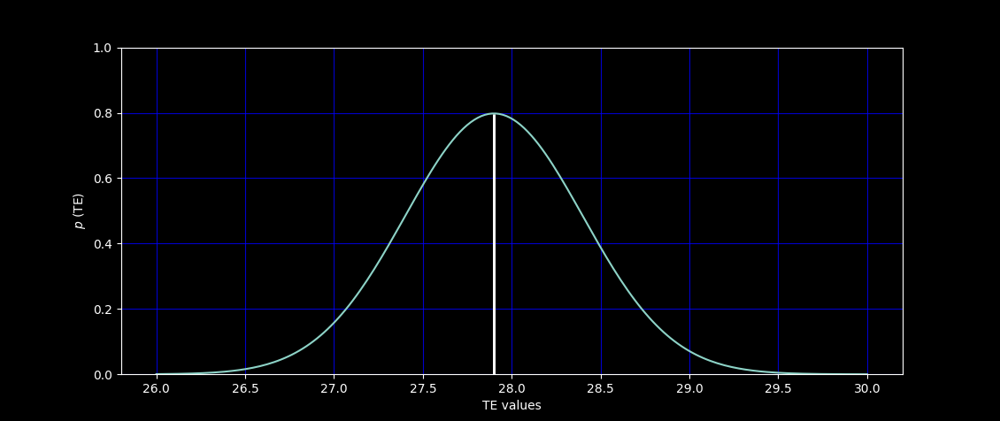
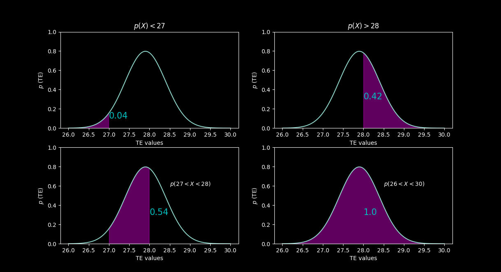
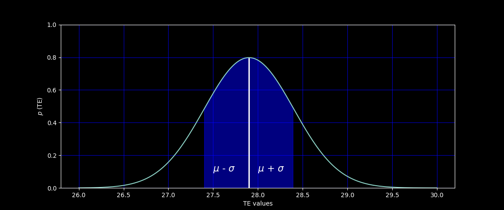

# Імітацыя аналагавай прылады #
> [!TIP]
> Русский вариант находится [здесь](./ReadMe.md).

У якасці аналагавай прылады выступае датчык тэмпературы. Значэнні тэмпературы
ў дадзенай праграме адпавядаюць функцыі звычайнага размеркавання.

## Нармальнае размеркаванне ##

Нармальнае размеркаванне - гэта бесперапыннае размеркаванне верагоднасцяў з
пікам у цэнтры і сіметрычнымі бакавымі бакамі, якое ў аднамерным выпадку 
задаецца функцыяй шчыльнасці верагоднасці, супадаючай з функцыяй Гаўса:

$$ f(x)= {1 \over (σ√2π)} e^{-{1\over 2}{\left(x-μ\over σ \right)}^2}$$

дзе ${μ}$ - матэматычнае чаканне, $σ$ - сярэднеквадратычнае адхіленне, $σ^2$ - 
дысперсія размеркавання.

Матэматычнае чаканне ${μ}$ - сярэдняе значэнне выпадковай велічыні ў выніку
шматразовага паўтарэння:

$$ μ ={\sum x \over n}$$

Напрыклад, значэнні пакаёвай тэмпературы могуць знаходзіцца прыкладна ў 
інтэрвале ад 26 °C да 30 °C. Калі на працягу ўсяго дня фіксаваць усе 
змены тэмпературы ў кабінеце, то, хутчэй за ўсё, мы ўбачым нешта такое 
[27.4, 26.9, 28.2, 29.1]. Матэматычным чаканнем або сярэднім значэннем 
для такога інтэрвалу значэнняў будзе 27.9 °C.

Матэматычнае чаканне ${μ}$ знаходзіцца на піку графіка. На восі $x$ 
знаходзяцца ўсе значэнні тэмпературы, вось $y$ паказвае верагоднасць таго,
што нашая выпадковая велічыня будзе мець зададзеную тэмпературу.

<p align="center">
 </p>
<p align="center"> Матэматычнае чаканне </p>

Верагоднасць $p$ можна вылічыць, палічыўшы плошчу графіка ў канкрэтным
інтэрвале. Плошча ўсяго графіка роўна 1.

<p align="center">
 </p>

Дысперсія - роскід значэнняў выпадковай велічыні адносна матэматычнага
чакання. Дысперсію можна вылічыць па формуле ніжэй:

$$ D={\sum (x-\mu)^2 \over n}$$

Квадрат у формуле патрэбен на выпадак адмоўных значэнняў. Вяртаючыся да нашага
прыкладу, дысперсія будзе роўная 0.695. Сама па сабе дысперсія не вельмі 
інфарматыўная, больш дакладнае разуменне наколькі безуважлівыя значэнні 
дае стандартнае адхіленне:

$$ \sigma ={\sqrt D} $$

Пры $D = 0.695$ атрымаем

$$ \sigma ={\sqrt {0.695} \approx 0.833667} °C$$

<p align="center">
 </p>
<p align="center"> Стандартнае адхіленне </p>

Гэта значыць, што чым больш $\sigma$, тым «шырэй» графік.

## Рэалізацыя ##

Файлы с рэалізацыей ```analog_emulator.h``` і ```analog_emulator.cpp``` 
знаходзяца у каталогу ```ptusa_main/Pac/common```. У класе
```analog_emulator``` вызначаны метады ```get_st_deviation()```, 
```get_m_expec()``` вяртаюць значэння стандартнага адхілення і матэматычнага
чакання. Матэматычнае чаканне і стандартнае адхіленне задаюцца ў параметрах 
канструктара.

Метад  ```get_value()``` з дапамогай аб'ектаў класа ```std::random_device```
(генеруе раўнамерна размеркаваныя цэлыя выпадковыя лікі) і 
```std::normal_distribution```  (генеруе выпадковыя лікі паводле звычайнага 
размеркавання) вяртае значэнні тэмпературы. Матэматычнае чаканне і стандартнае 
адхіленне $-$ параметры канструктара ```std::normal_distribution```. 
Каб у далейшым мець магчымасць змяніць параметры ў ```analog_emulator```
вызначаны метад ```param```, які прымае ў якасці аргументаў новыя значэнні 
матэматычнага чакання і стандартнага адхіленні.
