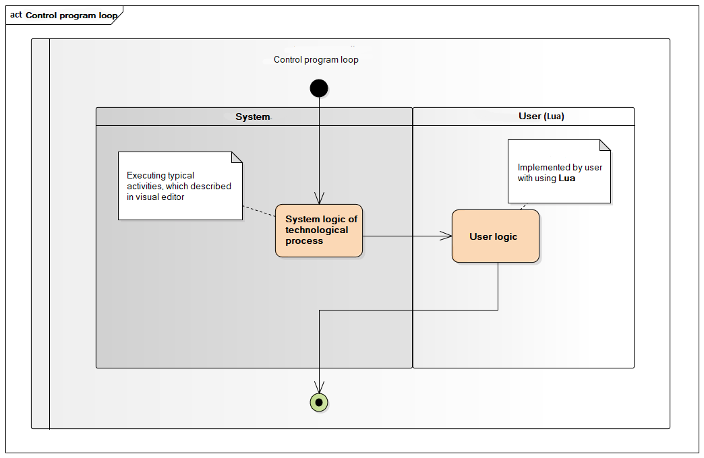

# ptusa #

[](https://github.com/savushkin-r-d/ptusa_main/actions/workflows/cmake.yml) [](https://codecov.io/gh/savushkin-r-d/ptusa_main) [](https://lgtm.com/projects/g/savushkin-r-d/ptusa_main/context:cpp)

Russian readme is [here](russian_readme/readme.md).

## Common description ##

Controller logic implemented by Lua-script. At runtime, control is passed through special Lua functions that are responsible for the various stages of the control program.

1. The general schema of controller program work:


2. Controller program loop looks like:



3. When operation turn on/off happens next:


4. During the execution of command happens next:


## How to build the project ##

You could clone repository by next command:
`git clone --recurse-submodules https://github.com/savushkin-r-d/ptusa_main.git`

or, if you are clonned without initializing and updating submodules, try next:
`git submodules update --init --recursive`

### win ###

Requirements:
1. Microsoft Visual Studio Community 2019

You should open (in Visual Studio) root directory. This you get a CMake based project.

2. Qt Creator

You could open file CMakeList.txt cloned repository in Qt.

Or clone reposytory in Qt:
    New -> Import Project -> Git Clone
    specify the repository link and check the box Recursive
	
3. Microsoft Visual Studio Community 2022

Before starting the project, you need to make sure that you have installed C++ CMake tools for Windows.
C++ CMake tools for Windows is installed as part of the Desktop development with C++.
Both C++ CMake tools for Windows Development with C++ are required for cross-platform CMake development.
Detailed installation information can be obtained [here](https://docs.microsoft.com/en-us/cpp/build/cmake-projects-in-visual-studio?view=msvc-160)
The CMake version required for the build: cmake_minimum_required(VERSION 3.13)

You should open (in Visual Studio) root directory. This you get a CMake based project.
If an error occurs after startup, then you should clear the CMake cache:
	Project -> Delete cache and perform reconfiguration

### linux ###

Eclipse IDE with CMake based project on Linux.

## How to run a project ##

To run demo project you should use this command line:

### win ###

1. After building and deploying *`windows-default`* cmake-configuration:

```cmd
    bin\install\windows-default\Release\ptusa_main.exe demo_projects/T1-PLCnext-Demo/main.plua path demo_projects/T1-PLCnext-Demo/ sys_path demo_projects/T1-PLCnext-Demo/sys/ debug
```
2. Launching a project in Microsoft Visual Studio Community 2022:
	Select a launch item -> ptusa_main.exe