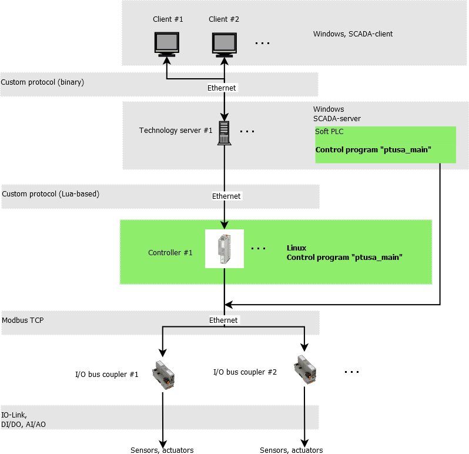
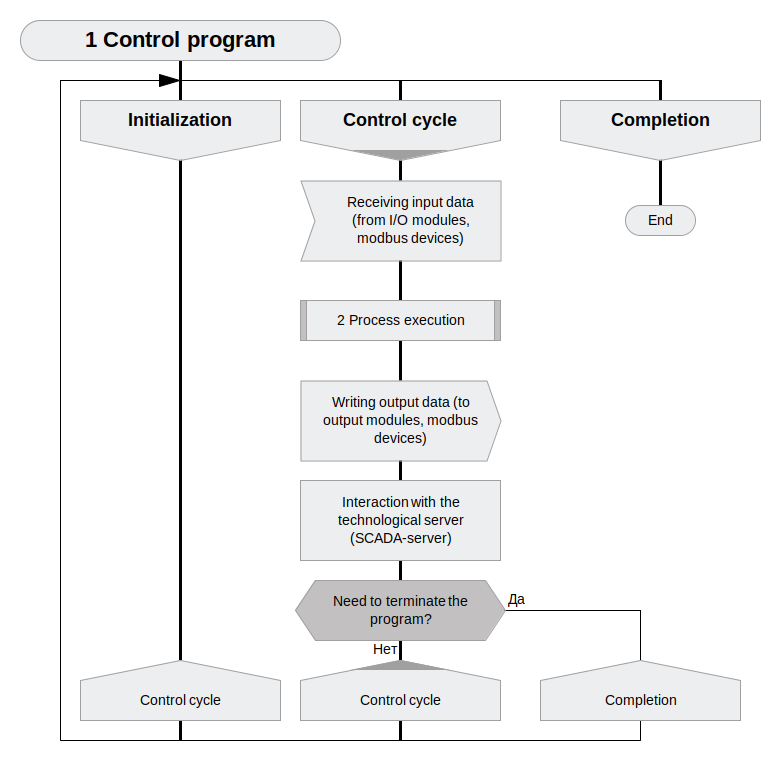
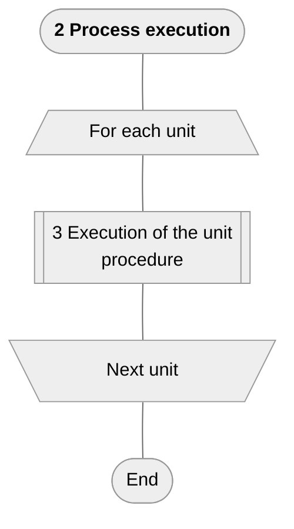
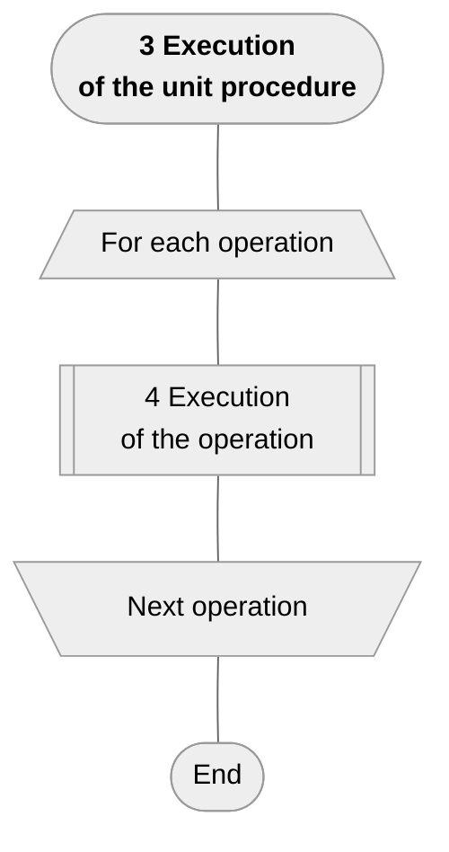
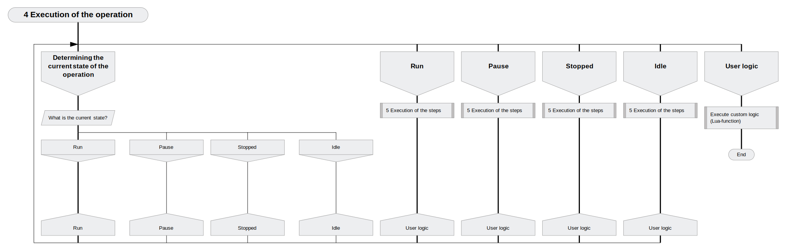
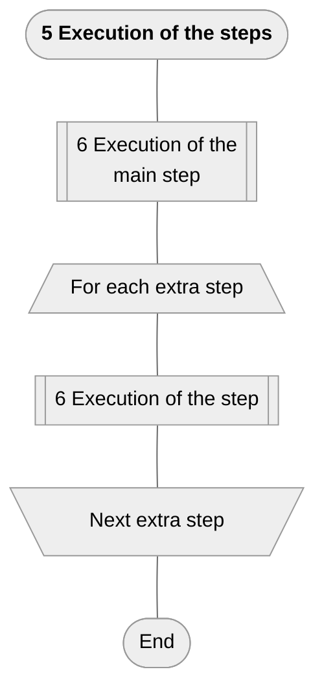
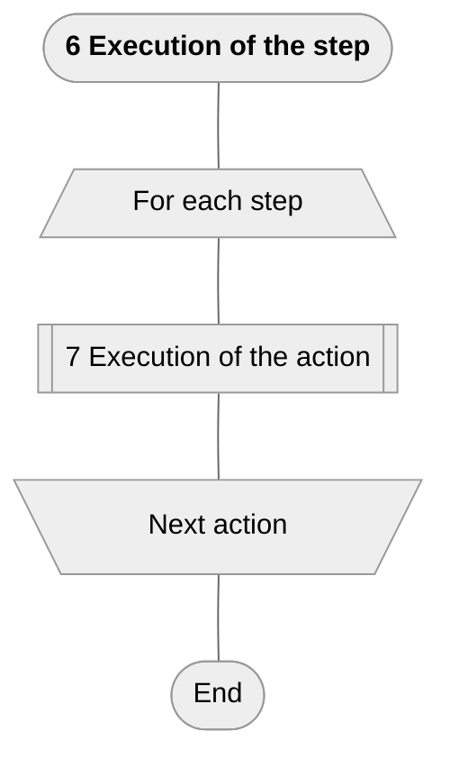
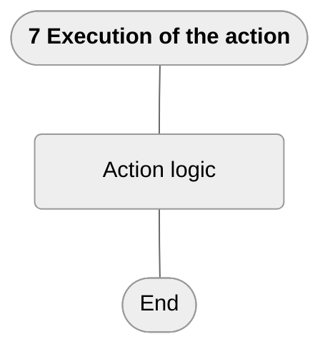
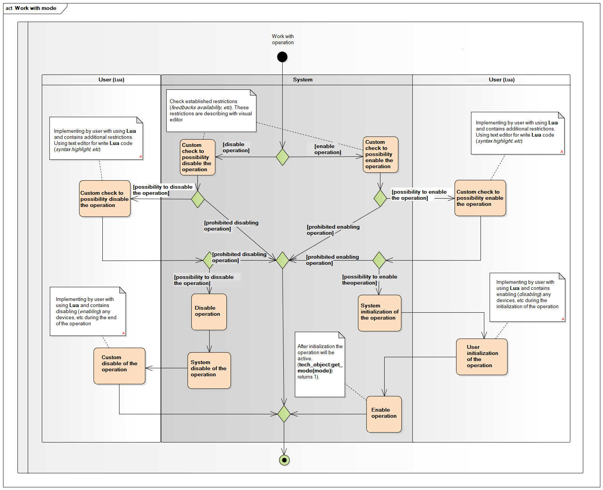
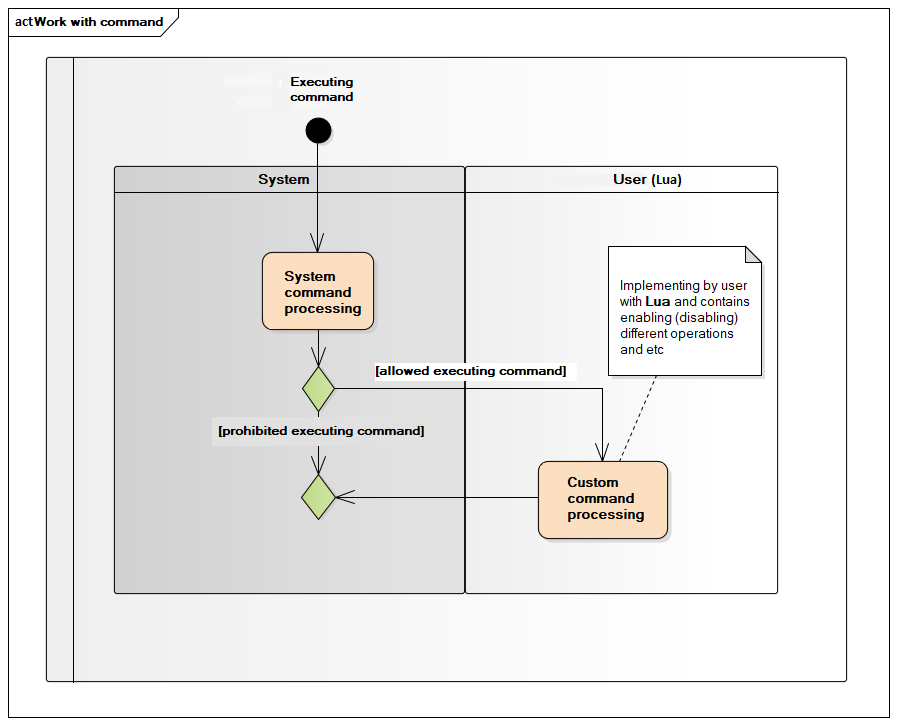

# ptusa_main #

[](https://www.openhub.net/p/ptusa_main/)
[](https://github.com/savushkin-r-d/ptusa_main/actions/workflows/cmake.yml)
[](https://codecov.io/gh/savushkin-r-d/ptusa_main)

[](https://github.com/savushkin-r-d/ptusa_main/releases/)

Russian readme is [here](docs/russian_readme/readme.md).

Program **``ptusa_main``** directly controls technological process.

## Content ##

1. [General system architecture](#general-system-architecture)
2. [Common description](#common-description)
3. [How to build the project](#how-to-build-the-project )
4. [Using PLCnext Technology C++ Toolchain in
Windows](#using-plcnext-technology-c-toolchain-in-windows)
5. [How to run a project](#how-to-run-a-project)
6. [Documentation](#documentation)

## General system architecture ##

General system architecture of the automated process control system (**APCS**)
is shown below:



## Common description ##

Controller logic implemented by Lua-script. At runtime, control is passed
through special Lua functions that are responsible for the various stages of
the control program.

+ The general schema of controller program work (in
[Drakon](https://drakonhub.com) diagram language, made with
[Mermaid](https://mermaid.js.org/)):



+ Execution of the technological process:













+ When operation is turned on (off) happens next:



+ During the execution of command happens next:



## How to build the project ##

You could clone repository by next command:
`git clone --recurse-submodules
https://github.com/savushkin-r-d/ptusa_main.git`

or, if you are cloned without initializing and updating submodules, try next:
`git submodule update --init --recursive`

### win ###

Requirements:

+ Qt Creator

You could open file CMakeLists.txt cloned repository in Qt.

Or clone repository in Qt:
    New -> Import Project -> Git Clone
    specify the repository link and check the box Recursive

+ Microsoft Visual Studio Community 2022

Before starting the project, you need to make sure that you have installed C++
CMake tools for Windows.
C++ CMake tools for Windows are installed using:

`Visual Studio Installer -> Development of classic applications in C++ -> C++
CMake tools for Windows`

Detailed installation information can be obtained
[here](https://docs.microsoft.com/en-us/cpp/build/cmake-projects-in-visual-studio?view=msvc-160).
The CMake version required for the build is 3.13 and above.

You should open (in Visual Studio) root directory. This you get a CMake based
project.
If an error occurs after startup, then you should clear the CMake cache
`Project -> Delete cache and perform reconfiguration`.

### Linux ###

Eclipse IDE with CMake based project on Linux.

## Using PLCnext Technology C++ Toolchain in Windows ##

Download the latest versions from the Phoenix Contact
[website](https://www.phoenixcontact.com/products) (for example, from the **AXC
F 2152** area) ```PLCnext Technology C++ toolchain for Windows```(current is
2023.0 LTS) and ```sdk for Windows 64 bit``` (current is 2022.0.4 LTS), in the
section Downloads->Software $-$ <http://www.phoenixcontact.com/qr/2404267/softw>.

Navigate to the folder where downloads are located (typical path
`%userprofile%/Downloads`), unzip the archive
(`SDK_2021.9_Windows_AXC_F_2152.tar.xz.zip`).

### Installing (updating) the SDK ###

Navigate to the folder where downloads are previously unzipped, Call the CLI in
the console using the following command:

```ps
plcncli.exe install sdk –d [installation path] –p [path to archive file]
```

>If you install several SDKs, Phoenix Contact recommends to use the "target
name/firmware version" folder structure.

Also your installation path must match with path in CMake.

E.g.:

```ps
plcncli.exe install sdk -d C:\CLI\sdks\AXCF2152\2022_0\ -p pxc-glibc-x86_64-mingw32-axcf2152-image-mingw-cortexa9t2hf-neon-axcf2152-toolchain-2022.0.tar.xz
```

>The SDK is specified to the controller. The full list of controllers can be
found on the PHOENIX CONTACT International site ([Home > Products > PLCs and
I/O systems > PLCnext Control > Product list PLCnext Technology
components](https://www.phoenixcontact.com/online/portal/pi?1dmy&urile=wcm%3apath%3a/pien/web/main/products/list_pages/PLCnext_technology_components_P-21-14-01/f77f0eb0-2a70-40c3-8679-7df2450e26db)).

## How to run a project ##

To run demo project you should use this command line:

### windows ###

+ After building and deploying *`windows-default`* cmake-configuration:

```cmd
    bin\install\windows-default\Release\ptusa_main.exe ^
    --path demo_projects/T1-PLCnext-Demo/ ^
    --sys_path demo_projects/T1-PLCnext-Demo/sys/ ^
    --debug ^
    demo_projects/T1-PLCnext-Demo/main.plua
```

+ Launching a project in Microsoft Visual Studio Community 2022: `Select a
launch item -> ptusa_main.exe`.

## Documentation ##

### Device Documentation ###

Documentation for supported devices can be found in the
[docs/devices](docs/devices/) directory.

Currently documented devices:

+ [TM311](docs/devices/TM311.md) - Endress+Hauser TM311 IO-Link Temperature
  Sensor (Technical Documentation)
+ [TM311 User Guide](docs/devices/TM311_user_guide.md) - User Guide for APCS
  Engineers (in Russian)

### Other Documentation ###

+ [Testing Strategy](docs/test/readme.md) - Information about testing approach
+ [Code Style Guide](docs/style.md) - Coding standards and conventions
+ [Contributing Guide](docs/CONTRIBUTING.md) - How to contribute to the project
