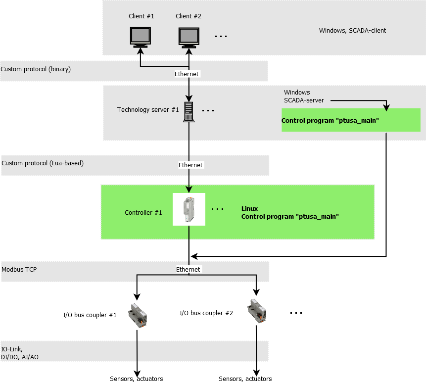
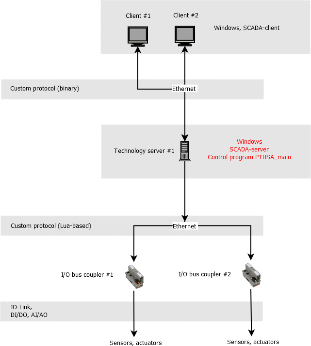
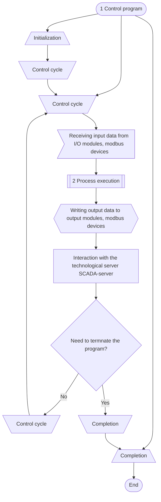
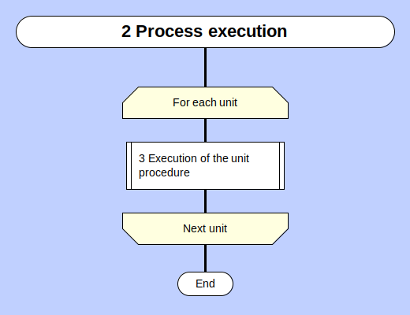
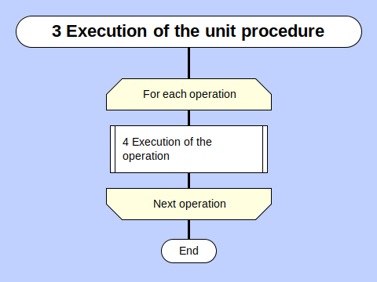
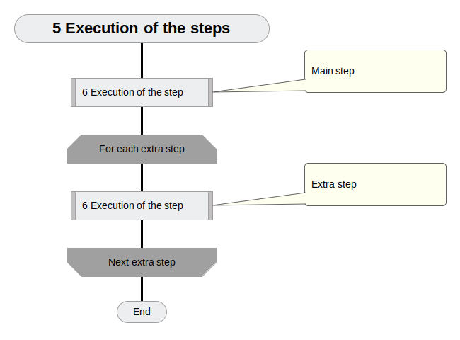
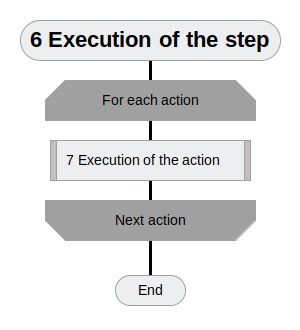
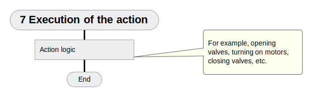
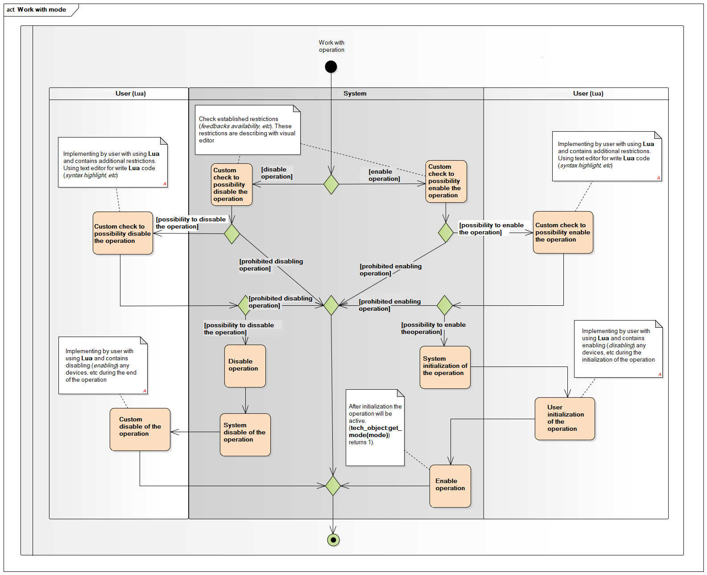
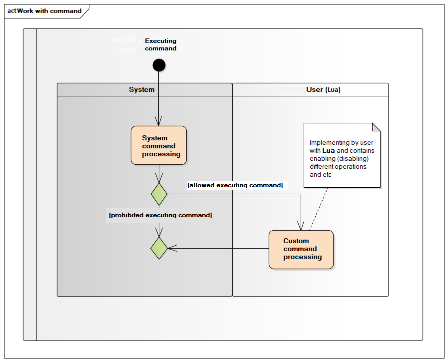

# ptusa_main #

[](https://www.openhub.net/p/ptusa_main/)
[](https://github.com/savushkin-r-d/ptusa_main/actions/workflows/cmake.yml)
[](https://codecov.io/gh/savushkin-r-d/ptusa_main)

[](https://github.com/savushkin-r-d/ptusa_main/releases/)

Russian readme is [here](russian_readme/readme.md).

## General system architecture ##

General system architecture is shown below:

<p align="center"></p>

General system architecture when the control program is deployed on the server:

<p align="center"></p>

## Common description ##

Controller logic implemented by Lua-script. At runtime, control is passed through special Lua functions that are responsible for the various stages of the control program.

1.  The general schema of controller program work, made with [mermaid](https://mermaid.js.org/):



2.  Execution of the technological process:

<p align="center"></p>

<p align="center"></p>

<p align="center"></p>

<p align="center"></p>

<p align="center"></p>

<p align="center"></p>

3.  When operation is turned on (off) happens next:

<p align="center"></p>

1.  During the execution of command happens next:
<p align="center"></p>

## How to build the project ##

You could clone repository by next command:
`git clone --recurse-submodules https://github.com/savushkin-r-d/ptusa_main.git`

or, if you are clonned without initializing and updating submodules, try next:
`git submodules update --init --recursive`

### win ###

Requirements:
1.  Microsoft Visual Studio Community 2019

You should open (in Visual Studio) root directory. This you get a CMake based project.

2. Qt Creator

You could open file CMakeList.txt cloned repository in Qt.

Or clone repository in Qt:
    New -> Import Project -> Git Clone
    specify the repository link and check the box Recursive

3.  Microsoft Visual Studio Community 2022

Before starting the project, you need to make sure that you have installed C++ CMake tools for Windows.
C++ CMake tools for Windows are installed using:

`Visual Studio Installer -> Development of classic applications in C++ -> C++ CMake tools for Windows`

Detailed installation information can be obtained [here](https://docs.microsoft.com/en-us/cpp/build/cmake-projects-in-visual-studio?view=msvc-160). The CMake version required for the build is 3.13 and above.

You should open (in Visual Studio) root directory. This you get a CMake based project.
If an error occurs after startup, then you should clear the CMake cache `Project -> Delete cache and perform reconfiguration`.

### linux ###

Eclipse IDE with CMake based project on Linux.

## How to run a project ##

To run demo project you should use this command line:

### win ###

1.  After building and deploying *`windows-default`* cmake-configuration:

```cmd
    bin\install\windows-default\Release\ptusa_main.exe demo_projects/T1-PLCnext-Demo/main.plua path demo_projects/T1-PLCnext-Demo/ sys_path demo_projects/T1-PLCnext-Demo/sys/ debug
```
2.  Launching a project in Microsoft Visual Studio Community 2022: `Select a launch item -> ptusa_main.exe`.

## Libraries used ##

### lua ###

Lua is a scripting programming language. A characteristic feature of Lua is implementation of a large number of program entities with a minimum of syntactic means.  
Thus, all composite user data types (arrays, structures, sets, queues, lists) are implemented through the mechanism of tables, and the mechanisms of object-oriented programming, including multiple inheritance, are implemented using metatables, which are also responsible for overloading operations and a number of other features.
Lua is a procedural dynamically typed modular language with automatic memory management. Includes basic elements to support functional and object programming styles. Thus, Lua can be called a multi-paradigm language. Built-in parallel programming tools allow you to write multithreaded programs only by means of the language, without accessing the operating system API or external libraries.  
Since the main purpose of Lua is embedding, it has effective means of interlanguage interaction, focused mainly on calling C libraries and working in a C environment. The language supports a small number of built-in data types: boolean values, numbers, strings, functions, streams. There are no typical combined data structures, such as arrays, sets, lists, and records; instead of all of them, one basic Lua structure is used a table.  
A separate type of *userdata* is designed specifically for low-level programming and data exchange with external code in other languages. Functions in Lua are objects of the first class, can be assigned and passed in parameters. Closures are supported, it is possible to create higher-order functions. The object system is prototypical, there is no explicit support for inheritance, but it is easily implemented using metatables.

Detailed information can be obtained [here](https://www.lua.org).

### tolua++ ###

Tolua is a tool that greatly simplifies the integration of C/C++ code with Lua. Based on a cleaned header file, tolua automatically generates the binding code to access C/C++ features from Lua. Using Lua API and tag method facilities, tolua maps C/C++ constants, external variables, functions, classes, and methods to Lua.
To use tolua, create a package file, a C/C++ cleaned header file, listing the constants, variables, functions, classes, and methods to want to export to the Lua environment. Then tolua parses this file and creates a C/C++ file that automatically binds the C/C++ code to Lua. If link the created file with our application, the specified C/C++ code can be accessed from Lua.

Detailed information can be obtained [here](https://web.tecgraf.puc-rio.br/~celes/tolua/tolua-3.2.html).

### zlib ###

Zlib is a software library used for data compression and is an abstraction of the DEFLATE compression algorithm used in their gzip file compression program.

Detailed information can be obtained [here](https://www.zlib.net).

### subhook ###

SubHook is a simple hooking library for C and C++ that works on Windows, Linux and macOS. It supports x86 only (32-bit and 64-bit).

Detailed information can be obtained [here](https://github.com/Zeex/subhook).

### googletest ###

Google Test is a library for unit testing in C++. Google Test is built on the xUnit testing methodology, that is, when individual parts of the program (classes, functions, modules) are tested separately from each other, in isolation. The library itself is developed with the active use of testing, when adding any parts to the official version, in addition to the code of the changes themselves, it is necessary to write a set of tests to confirm their correctness.

Detailed information can be obtained [here](https://github.com/google/googletest).

### google benchmark ###

Google benchmark is a microbenchmark support library. The library can be used with C++03. However, it requires C++11 to build, including compiler and standard library support.

Detailed information can be obtained [here](https://github.com/google/benchmark).
