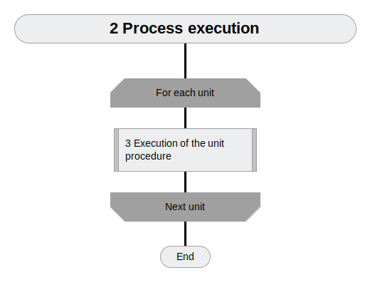
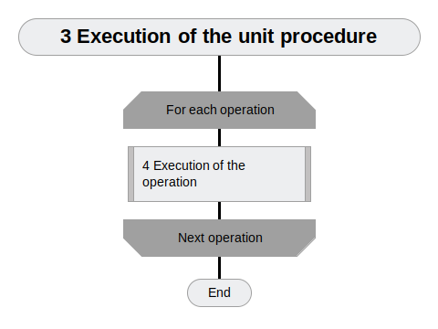

# ptusa_main #

[](https://www.openhub.net/p/ptusa_main/)
[](https://github.com/savushkin-r-d/ptusa_main/actions/workflows/cmake.yml)
[](https://codecov.io/gh/savushkin-r-d/ptusa_main)

[](https://github.com/savushkin-r-d/ptusa_main/releases/)

Russian readme is [here](russian_readme/readme.md).

## General system architecture ##

General system architecture is shown below:

<p align="center"></p>

## Common description ##

Controller logic implemented by Lua-script. At runtime, control is passed through special Lua functions that are responsible for the various stages of the control program.

1.  The general schema of controller program work (in [Drakon](https://drakonhub.com) diagram language):

<p align="center"></p>

2.  Execution of the technological process:

<p align="center"></p>

<p align="center"></p>

<p align="center"></p>

<p align="center"></p>

<p align="center"></p>

<p align="center"></p>

3.  When operation is turned on (off) happens next:

<p align="center"></p>

1.  During the execution of command happens next:
<p align="center"></p>

## How to build the project ##

You could clone repository by next command:
`git clone --recurse-submodules https://github.com/savushkin-r-d/ptusa_main.git`

or, if you are clonned without initializing and updating submodules, try next:
`git submodules update --init --recursive`

### win ###

Requirements:
1.  Microsoft Visual Studio Community 2019

You should open (in Visual Studio) root directory. This you get a CMake based project.

2. Qt Creator

You could open file CMakeList.txt cloned repository in Qt.

Or clone reposytory in Qt:
    New -> Import Project -> Git Clone
    specify the repository link and check the box Recursive
	
3.  Microsoft Visual Studio Community 2022

Before starting the project, you need to make sure that you have installed C++ CMake tools for Windows.
C++ CMake tools for Windows are installed using:

`Visual Studio Installer -> Development of classic applications in C++ -> C++ CMake tools for Windows`

Detailed installation information can be obtained [here](https://docs.microsoft.com/en-us/cpp/build/cmake-projects-in-visual-studio?view=msvc-160). The CMake version required for the build is 3.13 and above.

You should open (in Visual Studio) root directory. This you get a CMake based project.
If an error occurs after startup, then you should clear the CMake cache `Project -> Delete cache and perform reconfiguration`.

### linux ###

Eclipse IDE with CMake based project on Linux.

## How to run a project ##

To run demo project you should use this command line:

### win ###

1.  After building and deploying *`windows-default`* cmake-configuration:

```cmd
    bin\install\windows-default\Release\ptusa_main.exe demo_projects/T1-PLCnext-Demo/main.plua path demo_projects/T1-PLCnext-Demo/ sys_path demo_projects/T1-PLCnext-Demo/sys/ debug
```
2.  Launching a project in Microsoft Visual Studio Community 2022: `Select a launch item -> ptusa_main.exe`.