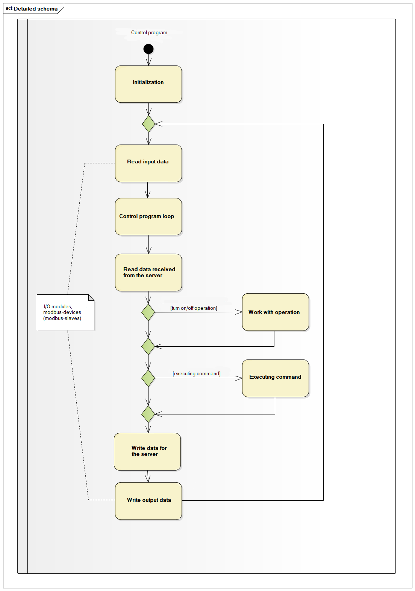

Russian readme is [here](russian_readme/readme.md).

# Common description #

Controller logic implemented by Lua-script. At runtime, control is passed through special Lua functions that are responsible for the various stages of the control program.

1. The general schema of controller program work:



2. Controller program loop looks like:


3. When operation turn on/off happens next:


4. During the execution of command happens next:


# How to build a project #

## win ##

Requirements:
1. Microsoft Visual Studio Community 2019

You should open (in Visual Studio) root directory. This you get a CMake based project.

## linux ##

Eclipse IDE with CMake based project on Linux.

# How to run a project #

To run demo project you should use this command line:

## win ##

```cmd
    "out\build\x64-Debug (по умолчанию)\PtusaPLCnextEngineer.exe" demo_project\main.plua path demo_project\ sys_path demo_project\sys\ debug
```
