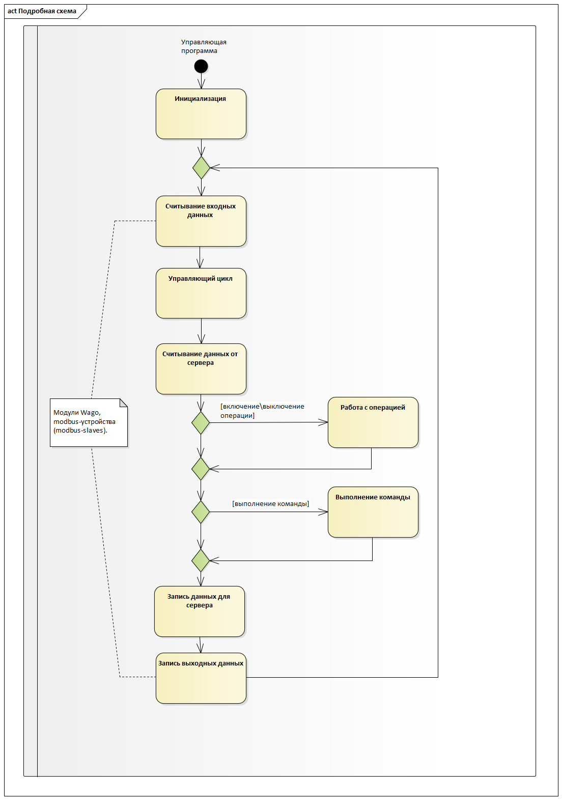
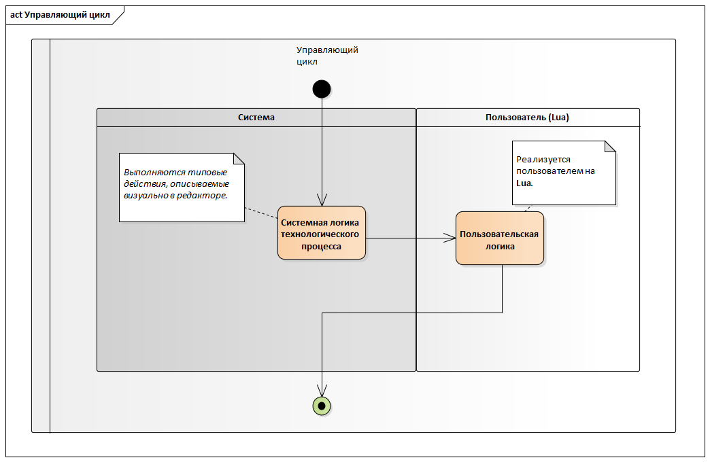

# Общее описание #

Управляющая логика реализуется в виде скрипта Lua. В ходе выполнения программы управление передается в отдельные специальные функции Lua, которые отвечают за отдельные этапы.

1. Общая схема работы управляющей программы:

2. Управляющий цикл выглядит так:

3. При включении/выключении операции происходит следующее:

4. При выполнении команды происходит следующее:

