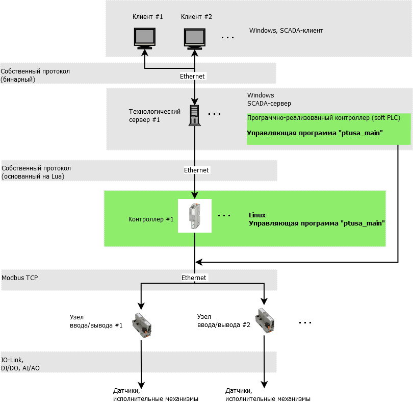
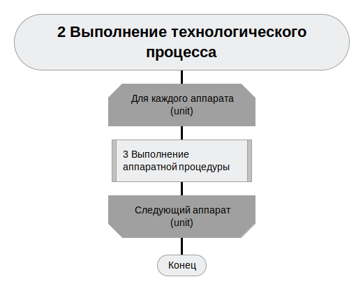

# ptusa_main #

## Общая архитектура системы ##

Общая архитектура системы изображена на рисунке ниже:



## Общее описание ##

Управляющая логика реализуется в виде скрипта Lua. В ходе выполнения программы управление передается в отдельные специальные функции Lua, которые отвечают за отдельные этапы.

1. Общая схема работы программы контроллера (в [Drakon](https://drakonhub.com) diagram language):

<p align="center"></p>

2.  Выполнение технологического процесса:

<p align="center"></p>

<p align="center"></p>

<p align="center"></p>

<p align="center"></p>

<p align="center"></p>

<p align="center"></p>

3. При включении/выключении операции происходит следующее:


4. При выполнении команды происходит следующее:


## Как собрать проект ##

Вы можете клонировать репозиторий при помощи следующей команды:
`git clone --recurse-submodules https://github.com/savushkin-r-d/ptusa_main.git`

Или, если вы клонировали проект без инициализированых и обновленных подмодулей, попробуйте следующее:
`git submodules update --init --recursive`

### win ###

Требования:

1. Qt Creator

В Qt вы можете открыть файл CMakeList.txt клонированого репозитория.

Или клонировать репозиторий используя Qt:
    Добавить -> Импортировать проект -> Клонирование Git
    указать ссылку на репозиторий и поставить галочку для рекурсивного клонирования.

2. Microsoft Visual Studio Community 2022

Перед запуском проекта необходимо убедиться в том, что у вас установлен C++ CMake tools for Windows.
Средства C++ CMake для Windows устанавливаются с помощью:

`Visual Studio Installer -> Разработка классических приложений на C++ -> Средства CMake C++ для Windows `

Подробную информацию по установке можно получить [здесь](https://docs.microsoft.com/ru-ru/cpp/build/cmake-projects-in-visual-studio?view=msvc-160). Версия CMake, необходимая для сборки: 3.13 и выше.

После этого вы должны открыть (в Visual Studio) корневой каталог. Таким образом, вы получаете проект на основе CMake.Если после запуска возникла ошибка, то следует очистить кэш CMake: `Проект -> Удалить кэш и выполнить перенастройку`.

3. Microsoft Visual Studio Community 2019

Вы должны открыть (в Visual Studio) корневой каталог. Таким образом, вы получаете проект на основе CMake.

## Как запустить проект ##

Для запуска демо проекта вы должны использовать эту команду:

### win ###

1. После сборки и развертывания *`windows-default`* конфигурации cmake:

```cmd
    bin\install\windows-default\Release\ptusa_main.exe demo_projects/T1-PLCnext-Demo/main.plua path demo_projects/T1-PLCnext-Demo/ sys_path demo_projects/T1-PLCnext-Demo/sys/ debug
```
2. Запуск проекта в Microsoft Visual Studio Community 2022: `Выбрать элемент запуска -> ptusa_main.exe`.