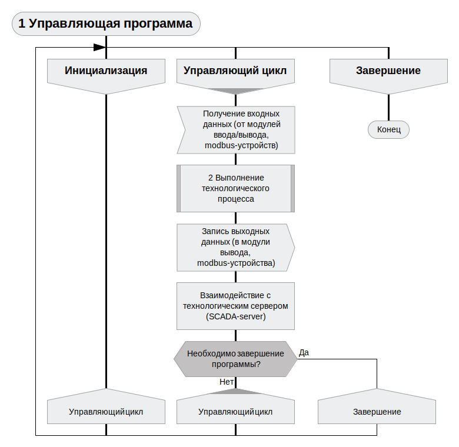
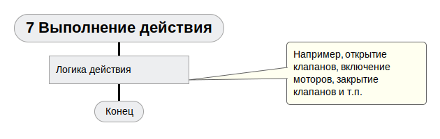

# ptusa_main #

## Общая архитектура системы ##

Общая архитектура системы изображена на рисунке ниже:


## Общее описание ##

Управляющая логика реализуется в виде скрипта Lua. В ходе выполнения программы управление передается в отдельные специальные функции Lua, которые отвечают за отдельные этапы.

1.  Общая схема работы программы контроллера (в [Drakon](https://drakonhub.com) diagram language):

<p align="center"></p>

2.  Выполнение технологического процесса:

<p align="center"></p>

<p align="center"></p>

<p align="center"></p>

<p align="center"></p>

<p align="center"></p>

<p align="center"></p>

3. При включении/выключении операции происходит следующее:


4. При выполнении команды происходит следующее:


## Как собрать проект ##

Вы можете клонировать репозиторий при помощи следующей команды:
`git clone --recurse-submodules https://github.com/savushkin-r-d/ptusa_main.git`

Или, если вы клонировали проект без инициализированных и обновленных подмодулей, попробуйте следующее:
`git submodules update --init --recursive`

### win ###

Требования:

1. Qt Creator

В Qt вы можете открыть файл CMakeList.txt клонированного репозитория.

Или клонировать репозиторий используя Qt:
    Добавить -> Импортировать проект -> Клонирование Git
    указать ссылку на репозиторий и поставить галочку для рекурсивного клонирования.

2. Microsoft Visual Studio Community 2022

Перед запуском проекта необходимо убедиться в том, что у вас установлен C++ CMake tools for Windows.
Средства C++ CMake для Windows устанавливаются с помощью:

`Visual Studio Installer -> Разработка классических приложений на C++ -> Средства CMake C++ для Windows `

Подробную информацию по установке можно получить [здесь](https://docs.microsoft.com/ru-ru/cpp/build/cmake-projects-in-visual-studio?view=msvc-160). Версия CMake, необходимая для сборки: 3.13 и выше.

После этого вы должны открыть (в Visual Studio) корневой каталог. Таким образом, вы получаете проект на основе CMake. Если после запуска возникла ошибка, то следует очистить кэш CMake: `Проект -> Удалить кэш и выполнить перенастройку`.

3. Microsoft Visual Studio Community 2019

Вы должны открыть (в Visual Studio) корневой каталог. Таким образом, вы получаете проект на основе CMake.

## Как запустить проект ##

Для запуска демо проекта вы должны использовать эту команду:

### win ###

1. После сборки и развертывания *`windows-default`* конфигурации cmake:

```cmd
    bin\install\windows-default\Release\ptusa_main.exe demo_projects/T1-PLCnext-Demo/main.plua path demo_projects/T1-PLCnext-Demo/ sys_path demo_projects/T1-PLCnext-Demo/sys/ debug
```
2. Запуск проекта в Microsoft Visual Studio Community 2022: `Выбрать элемент запуска -> ptusa_main.exe`.

## lua ##

Lua -  скриптовый язык программирования, разработанный в подразделении Tecgraf.
Интерпретатор языка является свободно распространяемым, с открытыми исходными текстами на языке Си.
Характерной особенностью Lua является реализация большого числа программных сущностей минимумом
синтаксических средств. Так, все составные пользовательские типы данных (массивы, структуры,
множества, очереди, списки) реализуются через механизм таблиц, а механизмы объектно-ориентированного
программирования, включая множественное наследование — с использованием метатаблиц,
которые также отвечают за перегрузку операций и ряд других возможностей.
Lua — это процедурный динамически типизированный модульный язык с автоматическим управлением памятью.
Включает базовые элементы для поддержки функционального и объектного стилей программирования.
Таким образом, Lua можно называть мультипарадигменным языком.
Встроенные средства параллельного программирования позволяют писать многопоточные программы
только средствами языка, не обращаясь к API операционной системы или внешним библиотекам.
Так как основным назначением Lua является встраивание, он имеет эффективные средства межъязыкового
взаимодействия, ориентированные, главным образом, на вызов библиотек Си и на работу в Си-окружении.
Язык поддерживает небольшое количество встроенных типов данных: логические значения, числа, строки, функции, потоки.
Типичные комбинированные структуры данных, такие как массивы, наборы, списки и записи, отсутствуют,
вместо всех их используется одна базовая структура Lua — таблица.
Отдельный тип *userdata* предназначен специально для низкоуровневого программирования и обмена данными с
внешним кодом на других языках.
Функции в Lua являются объектами первого класса, могут присваиваться и передаваться в параметрах.
Поддерживаются замыкания, есть возможность создания функций высших порядков.
Объектная система прототипная, отсутствует явная поддержка наследования, однако оно легко реализуется с помощью метатаблиц.

Подробную информацию можно получить [здесь](https://www.lua.org).

## Используемые библиотеки ##

### tolua++ ###

tolua - это инструмент, который значительно упрощает интеграцию кода C/C++ с Lua.
На основе чистого файла заголовка tolua автоматически генерирует код привязки для доступа к функциям C/C++ из Lua.
Используя Lua API и средства метода тегов, tolua сопоставляет константы C/C++, внешние переменные, функции, классы и методы с Lua.

#### как работает tolua ####

Чтобы использовать tolua, создается файл пакета, файл заголовка C/C++, содержащий список констант, переменных,
функций, классов и методов, которые мы хотим экспортировать в среду Lua. Затем tolua анализирует этот файл и создает файл C/C++,
который автоматически привязывает код C/C++ к Lua. Если связать созданный файл с приложением,
указанный код C/C++ может быть доступен из Lua.

Подробную информацию можно получить [здесь](https://web.tecgraf.puc-rio.br/~celes/tolua/tolua-3.2.html).

### zlib ###

zlib — свободная кроссплатформенная библиотека для сжатия данных и является обобщением алгоритма сжатия данных DEFLATE,
используемого в их компрессоре данных gzip.

Подробную информацию можно получить [здесь](https://zlib.net/apps.html).

### subhook ###

Subhook - это простая библиотека подключений для C и C++, которая работает в Windows, Linux и macOS, поддерживает только x86 (32-разрядную и 64-разрядную версии).

Подробную информацию можно получить [здесь](https://github.com/Zeex/subhook).

### googletest ###

Google Test - библиотека для модульного тестирования (англ. unit testing) на языке C++, построена на методологии тестирования xUnit, то есть когда отдельные части программы (классы, функции, модули) проверяются отдельно друг от друга, в изоляции. Библиотека сама по себе разработана с активным применением тестирования, когда при добавлении каких-либо частей в официальную версию, кроме кода самих изменений необходимо написать набор тестов, подтверждающих их корректность.

Подробную информацию можно получить [здесь](https://github.com/google/googletest).


